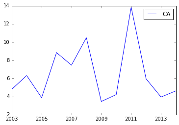

Using jsonstat.py
-----------------

This Jupyter notebook is to show the python library
`jsonstat.py <http://github.com/26fe/jsonstat.py>`__ in action. The
oecd-canada.json is used in the following examples.

.. code:: python

    import os
    import pandas as ps
    import jsonstat

Download or use the jsonstat file on disk

.. code:: python

    url = 'http://json-stat.org/samples/oecd-canada.json'
    file_name = "oecd-canada.json"
    
    file_path = os.path.abspath(os.path.join("..", "tests", "fixtures", "collection", file_name))
    if os.path.exists(file_path):
        print("using file from fixtures")
    else:
        print("download file into the current directory")
        jsonstat.download(url, file_name)
        file_path = file_name

.. parsed-literal::

    using file from fixtures

Initialize JsonStatCollection from the file and print some info.

.. code:: python

    collection = jsonstat.JsonStatCollection()
    collection.from_file(file_path)
    collection.info()

.. parsed-literal::

    dataset: 'canada'
    dataset: 'oecd'

.. code:: python

    oecd = collection.dataset('oecd')
    print "*** dataset '{} info".format(oecd.name())
    oecd.info()

.. parsed-literal::

    *** dataset 'oecd info
    name:   'oecd'
    label:  'Unemployment rate in the OECD countries 2003-2014'
    source: 'Unemployment rate in the OECD countries 2003-2014'
    
    dimensions:
    dim id/name: 'concept' size: '1' role: 'metric'
    dim id/name: 'area' size: '36' role: 'geo'
    dim id/name: 'year' size: '12' role: 'time'

.. code:: python

    for d in oecd.dimensions():
        print "\n*** info for dimensions '{}'".format(d.name())
        d.info()

.. parsed-literal::

    
    *** info for dimensions 'concept'
    index
      pos    idx  label
        0    UNR       
    
    *** info for dimensions 'year'
    index
      pos    idx  label
        0   2003       
        1   2004       
        2   2005       
        3   2006       
        4   2007       
        5   2008       
        6   2009       
        7   2010       
        8   2011       
        9   2012       
       10   2013       
       11   2014       
    
    *** info for dimensions 'area'
    index
      pos    idx  label
        0     AU Australia
        1     AT Austria
        2     BE Belgium
        3     CA Canada
        4     CL  Chile
        5     CZ Czech Republic
        6     DK Denmark
        7     EE Estonia
        8     FI Finland
        9     FR France
       10     DE Germany
       11     GR Greece
       12     HU Hungary
       13     IS Iceland
       14     IE Ireland
       15     IL Israel
       16     IT  Italy
       17     JP  Japan
       18     KR  Korea
       19     LU Luxembourg
       20     MX Mexico
       21     NL Netherlands
       22     NZ New Zealand
       23     NO Norway
       24     PL Poland
       25     PT Portugal
       26     SK Slovak Republic
       27     SI Slovenia
       28     ES  Spain
       29     SE Sweden
       30     CH Switzerland
       31     TR Turkey
       32     UK United Kingdom
       33     US United States
       34   EU15 Euro area (15 countries)
       35   OECD  total

.. code:: python

    "*** value oecd(area:IT,year:2012): {}".format(oecd.value(area='IT', year='2012'))

.. parsed-literal::

    '*** value oecd(area:IT,year:2012): 8.264570818'

.. code:: python

    df = oecd.to_data_frame('year', area='CA')
    print(df)

.. parsed-literal::

                 CA
    2003   4.789363
    2004   6.307841
    2005   3.868296
    2006   8.835277
    2007   7.451741
    2008  10.475967
    2009   3.450432
    2010   4.209946
    2011  13.840391
    2012   5.945157
    2013   3.941659
    2014   4.617465

.. code:: python

    import matplotlib as plt
    %matplotlib inline
    df.plot()

.. parsed-literal::

    <matplotlib.axes._subplots.AxesSubplot at 0x107d87e90>

