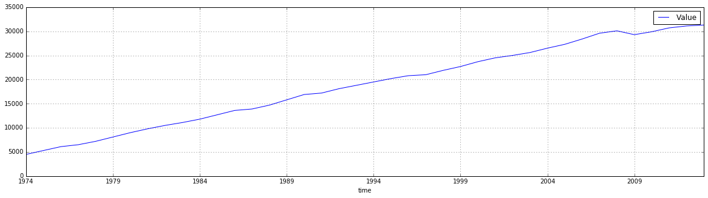

Notebook: using jsonstat.py with eurostat api
~~~~~~~~~~~~~~~~~~~~~~~~~~~~~~~~~~~~~~~~~~~~~

This Jupyter notebook shows the python library
`jsonstat.py <http://github.com/26fe/jsonstat.py>`__ in action. It shows
how to explore dataset downloaded from a data provider. This notebook
uses some datasets from Eurostat.

Eurostat provides a rest api to download its datasets. You can find
details about the api
`here <http://ec.europa.eu/eurostat/web/json-and-unicode-web-services>`__
It is possible to use a `query
builder <http://ec.europa.eu/eurostat/web/json-and-unicode-web-services/getting-started/query-builder>`__
for discovering the rest api parameters

.. code:: python

    # all import here
    from __future__ import print_function
    import os
    import pandas as pd
    import jsonstat
    
    import matplotlib as plt
    %matplotlib inline

Exploring data with one dimension (time) with size > 1
^^^^^^^^^^^^^^^^^^^^^^^^^^^^^^^^^^^^^^^^^^^^^^^^^^^^^^

Download or use the json file cached on disk. Caching file is useful to
avoid download file every time. Caching can speed the development, and
provides consistent result. You can see the raw data
`here <http://ec.europa.eu/eurostat/wdds/rest/data/v1.1/json/en/nama_gdp_c?precision=1&geo=IT&unit=EUR_HAB&indic_na=B1GM>`__

.. code:: python

    url_1 = 'http://ec.europa.eu/eurostat/wdds/rest/data/v1.1/json/en/nama_gdp_c?precision=1&geo=IT&unit=EUR_HAB&indic_na=B1GM'
    file_name_1 = "eurostat-name_gpd_c-geo_IT.json"
    
    file_path_1 = os.path.abspath(os.path.join("..", "tests", "fixtures", "eurostat", file_name_1))
    if os.path.exists(file_path_1):
        print("using alredy donwloaded file {}".format(file_path_1))
    else:
        print("download file")
        jsonstat.download(url_1, file_name_1)
        file_path_1 = file_name_1

.. parsed-literal::

    using alredy donwloaded file /Users/26fe_nas/gioprj.on_mac/prj.python/jsonstat.py/tests/fixtures/eurostat/eurostat-name_gpd_c-geo_IT.json

Initialize JsonStatCollection with eurostat data and print some info
about the collection.

.. code:: python

    collection_1 = jsonstat.from_file(file_path_1)
    collection_1

.. parsed-literal::

    JsonstatCollection contains the following JsonStatDataSet:
    0: dataset 'nama_gdp_c'

Previous collection contains only a dataset named '``nama_gdp_c``'

.. code:: python

    nama_gdp_c_1 = collection_1.dataset('nama_gdp_c')
    nama_gdp_c_1

.. parsed-literal::

    name:   'nama_gdp_c'
    title:  'GDP and main components - Current prices'
    size: 69
    4 dimensions:
      0: dim id: 'unit' label: 'unit' size: '1' role: 'None'
      1: dim id: 'indic_na' label: 'indic_na' size: '1' role: 'None'
      2: dim id: 'geo' label: 'geo' size: '1' role: 'None'
      3: dim id: 'time' label: 'time' size: '69' role: 'None'

All dimensions of the dataset '``nama_gdp_c``' are of size 1 with
exception of ``time`` dimension. Let's explore the time dimension.

.. code:: python

    nama_gdp_c_1.dimension('time')

.. parsed-literal::

    index
      pos idx      label   
        0 '1946'   '1946'  
        1 '1947'   '1947'  
        2 '1948'   '1948'  
        3 '1949'   '1949'  
        4 '1950'   '1950'  
        5 '1951'   '1951'  
        6 '1952'   '1952'  
        7 '1953'   '1953'  
        8 '1954'   '1954'  
        9 '1955'   '1955'  
       10 '1956'   '1956'  
       11 '1957'   '1957'  
       12 '1958'   '1958'  
       13 '1959'   '1959'  
       14 '1960'   '1960'  
       15 '1961'   '1961'  
       16 '1962'   '1962'  
       17 '1963'   '1963'  
       18 '1964'   '1964'  
       19 '1965'   '1965'  
       20 '1966'   '1966'  
       21 '1967'   '1967'  
       22 '1968'   '1968'  
       23 '1969'   '1969'  
       24 '1970'   '1970'  
       25 '1971'   '1971'  
       26 '1972'   '1972'  
       27 '1973'   '1973'  
       28 '1974'   '1974'  
       29 '1975'   '1975'  
       30 '1976'   '1976'  
       31 '1977'   '1977'  
       32 '1978'   '1978'  
       33 '1979'   '1979'  
       34 '1980'   '1980'  
       35 '1981'   '1981'  
       36 '1982'   '1982'  
       37 '1983'   '1983'  
       38 '1984'   '1984'  
       39 '1985'   '1985'  
       40 '1986'   '1986'  
       41 '1987'   '1987'  
       42 '1988'   '1988'  
       43 '1989'   '1989'  
       44 '1990'   '1990'  
       45 '1991'   '1991'  
       46 '1992'   '1992'  
       47 '1993'   '1993'  
       48 '1994'   '1994'  
       49 '1995'   '1995'  
       50 '1996'   '1996'  
       51 '1997'   '1997'  
       52 '1998'   '1998'  
       53 '1999'   '1999'  
       54 '2000'   '2000'  
       55 '2001'   '2001'  
       56 '2002'   '2002'  
       57 '2003'   '2003'  
       58 '2004'   '2004'  
       59 '2005'   '2005'  
       60 '2006'   '2006'  
       61 '2007'   '2007'  
       62 '2008'   '2008'  
       63 '2009'   '2009'  
       64 '2010'   '2010'  
       65 '2011'   '2011'  
       66 '2012'   '2012'  
       67 '2013'   '2013'  
       68 '2014'   '2014'  

Get value for year 2012.

.. code:: python

    nama_gdp_c_1.value(time='2012')

.. parsed-literal::

    25700

Convert the jsonstat data into a pandas dataframe.

.. code:: python

    df_1 = nama_gdp_c_1.to_data_frame('time', content='id')
    df_1.tail()

.. raw:: html

    

    <table border="1" class="dataframe">
      <thead>
        <tr style="text-align: right;">
          <th></th>
          <th>unit</th>
          <th>indic_na</th>
          <th>geo</th>
          <th>Value</th>
        </tr>
        <tr>
          <th>time</th>
          <th></th>
          <th></th>
          <th></th>
          <th></th>
        </tr>
      </thead>
      <tbody>
        <tr>
          <th>2010</th>
          <td>EUR_HAB</td>
          <td>B1GM</td>
          <td>IT</td>
          <td>25700</td>
        </tr>
        <tr>
          <th>2011</th>
          <td>EUR_HAB</td>
          <td>B1GM</td>
          <td>IT</td>
          <td>26000</td>
        </tr>
        <tr>
          <th>2012</th>
          <td>EUR_HAB</td>
          <td>B1GM</td>
          <td>IT</td>
          <td>25700</td>
        </tr>
        <tr>
          <th>2013</th>
          <td>EUR_HAB</td>
          <td>B1GM</td>
          <td>IT</td>
          <td>25600</td>
        </tr>
        <tr>
          <th>2014</th>
          <td>EUR_HAB</td>
          <td>B1GM</td>
          <td>IT</td>
          <td>NaN</td>
        </tr>
      </tbody>
    </table>
    

Adding a simple plot

.. code:: python

    df_1 = df_1.dropna() # remove rows with NaN values
    df_1.plot(grid=True)

.. parsed-literal::

    <matplotlib.axes._subplots.AxesSubplot at 0x1127c1160>

.. image:: eurostat_files/eurostat_15_1.png

Exploring data with two dimensions (geo, time) with size > 1
^^^^^^^^^^^^^^^^^^^^^^^^^^^^^^^^^^^^^^^^^^^^^^^^^^^^^^^^^^^^

Download or use the jsonstat file cached on disk. The cache is used to
avoid internet download during the devolopment to make the things a bit
faster. You can see the raw data
`here <http://ec.europa.eu/eurostat/wdds/rest/data/v1.1/json/en/nama_gdp_c?precision=1&geo=IT&geo=FR&unit=EUR_HAB&indic_na=B1GM>`__

.. code:: python

    url_2 = 'http://ec.europa.eu/eurostat/wdds/rest/data/v1.1/json/en/nama_gdp_c?precision=1&geo=IT&geo=FR&unit=EUR_HAB&indic_na=B1GM'
    file_name_2 = "eurostat-name_gpd_c-geo_IT_FR.json"
    
    file_path_2 = os.path.abspath(os.path.join("..", "tests", "fixtures", "eurostat", file_name_2))
    if os.path.exists(file_path_2):
        print("using alredy donwloaded file {}".format(file_path_2))
    else:
        print("download file and storing on disk")
        jsonstat.download(url, file_name_2)
        file_path_2 = file_name_2

.. parsed-literal::

    using alredy donwloaded file /Users/26fe_nas/gioprj.on_mac/prj.python/jsonstat.py/tests/fixtures/eurostat/eurostat-name_gpd_c-geo_IT_FR.json

.. code:: python

    collection_2 = jsonstat.from_file(file_path_2)
    nama_gdp_c_2 = collection_2.dataset('nama_gdp_c')
    nama_gdp_c_2

.. parsed-literal::

    name:   'nama_gdp_c'
    title:  'GDP and main components - Current prices'
    size: 138
    4 dimensions:
      0: dim id: 'unit' label: 'unit' size: '1' role: 'None'
      1: dim id: 'indic_na' label: 'indic_na' size: '1' role: 'None'
      2: dim id: 'geo' label: 'geo' size: '2' role: 'None'
      3: dim id: 'time' label: 'time' size: '69' role: 'None'

.. code:: python

    nama_gdp_c_2.dimension('geo')

.. parsed-literal::

    index
      pos idx      label   
        0 'FR'     'France'
        1 'IT'     'Italy' 

.. code:: python

    nama_gdp_c_2.value(time='2012',geo='IT')

.. parsed-literal::

    25700

.. code:: python

    nama_gdp_c_2.value(time='2012',geo='FR')

.. parsed-literal::

    31100

.. code:: python

    df_2 = nama_gdp_c_2.to_table(content='id',rtype=pd.DataFrame)
    df_2.tail()

.. raw:: html

    

    <table border="1" class="dataframe">
      <thead>
        <tr style="text-align: right;">
          <th></th>
          <th>unit</th>
          <th>indic_na</th>
          <th>geo</th>
          <th>time</th>
          <th>Value</th>
        </tr>
      </thead>
      <tbody>
        <tr>
          <th>133</th>
          <td>EUR_HAB</td>
          <td>B1GM</td>
          <td>IT</td>
          <td>2010</td>
          <td>25700</td>
        </tr>
        <tr>
          <th>134</th>
          <td>EUR_HAB</td>
          <td>B1GM</td>
          <td>IT</td>
          <td>2011</td>
          <td>26000</td>
        </tr>
        <tr>
          <th>135</th>
          <td>EUR_HAB</td>
          <td>B1GM</td>
          <td>IT</td>
          <td>2012</td>
          <td>25700</td>
        </tr>
        <tr>
          <th>136</th>
          <td>EUR_HAB</td>
          <td>B1GM</td>
          <td>IT</td>
          <td>2013</td>
          <td>25600</td>
        </tr>
        <tr>
          <th>137</th>
          <td>EUR_HAB</td>
          <td>B1GM</td>
          <td>IT</td>
          <td>2014</td>
          <td>NaN</td>
        </tr>
      </tbody>
    </table>
    

.. code:: python

    df_FR_IT = df_2.dropna()[['time', 'geo', 'Value']]
    df_FR_IT = df_FR_IT.pivot('time', 'geo', 'Value')
    df_FR_IT.plot(grid=True)

.. parsed-literal::

    <matplotlib.axes._subplots.AxesSubplot at 0x112d7a6d8>

.. image:: eurostat_files/eurostat_23_1.png

.. code:: python

    df_3 = nama_gdp_c_2.to_data_frame('time', content='id', blocked_dims={'geo':'FR'})
    df_3 = df_3.dropna()
    df_3.plot(grid=True)

.. parsed-literal::

    <matplotlib.axes._subplots.AxesSubplot at 0x112da0fd0>

.. code:: python

    df_4 = nama_gdp_c_2.to_data_frame('time', content='id', blocked_dims={'geo':'IT'})
    df_4 = df_4.dropna()
    df_4.plot(grid=True)

.. parsed-literal::

    <matplotlib.axes._subplots.AxesSubplot at 0x112eed518>

