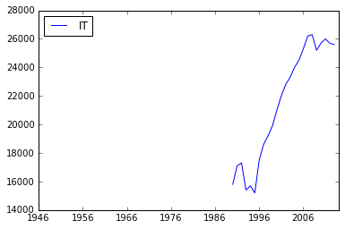
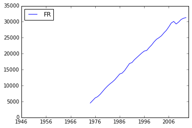

Notebook: using jsonstat.py with eurostat api
---------------------------------------------

This Jupyter notebook shows the python library
`jsonstat.py <http://github.com/26fe/jsonstat.py>`__ in action. Eurostat
provides a rest api to download its datasets. You can find details about
the api
`here <http://ec.europa.eu/eurostat/web/json-and-unicode-web-services>`__
It is possible to use a `query
builder <http://ec.europa.eu/eurostat/web/json-and-unicode-web-services/getting-started/query-builder>`__
for discovering the rest api parameters

.. code:: python

    from __future__ import print_function
    import os
    import pandas as ps
    import jsonstat

Exploring data with one dimension (time) with size > 1
~~~~~~~~~~~~~~~~~~~~~~~~~~~~~~~~~~~~~~~~~~~~~~~~~~~~~~

Download or use the json file cached on disk. Caching file is useful to
avoid download file every time. Caching can speed the development, and
provide consistent result. You can see the raw data
`here <http://ec.europa.eu/eurostat/wdds/rest/data/v1.1/json/en/nama_gdp_c?precision=1&geo=IT&unit=EUR_HAB&indic_na=B1GM>`__

.. code:: python

    url = 'http://ec.europa.eu/eurostat/wdds/rest/data/v1.1/json/en/nama_gdp_c?precision=1&geo=IT&unit=EUR_HAB&indic_na=B1GM'
    file_name = "eurostat-name_gpd_c-geo_IT.json"
    
    file_path = os.path.abspath(os.path.join("..", "tests", "fixtures", "eurostat", file_name))
    if os.path.exists(file_path):
        print("using file from fixtures")
    else:
        print("download file into the current directory")
        jsonstat.download(url, file_name)
        file_path = file_name

.. parsed-literal::

    using file from fixtures

Initialize JsonStatCollection and print some info.

.. code:: python

    collection = jsonstat.JsonStatCollection()
    collection.from_file(file_path)

.. parsed-literal::

    0: dataset 'nama_gdp_c'

.. code:: python

    nama_gdp_c = collection.dataset('nama_gdp_c')
    nama_gdp_c

.. parsed-literal::

    name:   'nama_gdp_c'
    title:  'GDP and main components - Current prices'
    size: 69
    4 dimensions:
      0: dim id/name: 'unit' size: '1' role: 'None'
      1: dim id/name: 'indic_na' size: '1' role: 'None'
      2: dim id/name: 'geo' size: '1' role: 'None'
      3: dim id/name: 'time' size: '69' role: 'None'

The only dataset contained is ``nama_gdp_c``. All dimensions are of size
1 with exception of time dimension. Let's explore the time dimension.

.. code:: python

    nama_gdp_c.dimension('time')

.. parsed-literal::

    index
      pos    idx  label
        0   1946   1946
        1   1947   1947
        2   1948   1948
        3   1949   1949
        4   1950   1950
        5   1951   1951
        6   1952   1952
        7   1953   1953
        8   1954   1954
        9   1955   1955
       10   1956   1956
       11   1957   1957
       12   1958   1958
       13   1959   1959
       14   1960   1960
       15   1961   1961
       16   1962   1962
       17   1963   1963
       18   1964   1964
       19   1965   1965
       20   1966   1966
       21   1967   1967
       22   1968   1968
       23   1969   1969
       24   1970   1970
       25   1971   1971
       26   1972   1972
       27   1973   1973
       28   1974   1974
       29   1975   1975
       30   1976   1976
       31   1977   1977
       32   1978   1978
       33   1979   1979
       34   1980   1980
       35   1981   1981
       36   1982   1982
       37   1983   1983
       38   1984   1984
       39   1985   1985
       40   1986   1986
       41   1987   1987
       42   1988   1988
       43   1989   1989
       44   1990   1990
       45   1991   1991
       46   1992   1992
       47   1993   1993
       48   1994   1994
       49   1995   1995
       50   1996   1996
       51   1997   1997
       52   1998   1998
       53   1999   1999
       54   2000   2000
       55   2001   2001
       56   2002   2002
       57   2003   2003
       58   2004   2004
       59   2005   2005
       60   2006   2006
       61   2007   2007
       62   2008   2008
       63   2009   2009
       64   2010   2010
       65   2011   2011
       66   2012   2012
       67   2013   2013
       68   2014   2014

Get value for year 2012.

.. code:: python

    nama_gdp_c.value(time='2012')

.. parsed-literal::

    25700

.. code:: python

    df = nama_gdp_c.to_data_frame('time', geo='IT')
    print(df)

.. parsed-literal::

             IT
    1946    NaN
    1947    NaN
    1948    NaN
    1949    NaN
    1950    NaN
    1951    NaN
    1952    NaN
    1953    NaN
    1954    NaN
    1955    NaN
    1956    NaN
    1957    NaN
    1958    NaN
    1959    NaN
    1960    NaN
    1961    NaN
    1962    NaN
    1963    NaN
    1964    NaN
    1965    NaN
    1966    NaN
    1967    NaN
    1968    NaN
    1969    NaN
    1970    NaN
    1971    NaN
    1972    NaN
    1973    NaN
    1974    NaN
    1975    NaN
    ...     ...
    1985    NaN
    1986    NaN
    1987    NaN
    1988    NaN
    1989    NaN
    1990  15800
    1991  17100
    1992  17300
    1993  15400
    1994  15700
    1995  15200
    1996  17500
    1997  18600
    1998  19200
    1999  19900
    2000  21000
    2001  22000
    2002  22800
    2003  23300
    2004  24000
    2005  24500
    2006  25300
    2007  26200
    2008  26300
    2009  25200
    2010  25700
    2011  26000
    2012  25700
    2013  25600
    2014    NaN
    
    [69 rows x 1 columns]

.. code:: python

    import matplotlib as plt
    %matplotlib inline
    df.plot()

.. parsed-literal::

    <matplotlib.axes._subplots.AxesSubplot at 0x108b13dd0>

Exploring data with two dimensions (geo, time) with size > 1
~~~~~~~~~~~~~~~~~~~~~~~~~~~~~~~~~~~~~~~~~~~~~~~~~~~~~~~~~~~~

Download or use the jsonstat file cached on disk. The cache is used to
avoid internet download during the devolopment to make the things a bit
faster. You can see the raw data
`here <http://ec.europa.eu/eurostat/wdds/rest/data/v1.1/json/en/nama_gdp_c?precision=1&geo=IT&geo=FR&unit=EUR_HAB&indic_na=B1GM>`__

.. code:: python

    url = 'http://ec.europa.eu/eurostat/wdds/rest/data/v1.1/json/en/nama_gdp_c?precision=1&geo=IT&geo=FR&unit=EUR_HAB&indic_na=B1GM'
    file_name = "eurostat-name_gpd_c-geo_IT_FR.json"
    
    file_path = os.path.abspath(os.path.join("..", "tests", "fixtures", "eurostat", file_name))
    if os.path.exists(file_path):
        print("using file from fixtures")
    else:
        print("download file into the current directory")
        jsonstat.download(url, file_name)
        file_path = file_name

.. parsed-literal::

    using file from fixtures

.. code:: python

    collection = jsonstat.JsonStatCollection()
    collection.from_file(file_path)
    nama_gdp_c = collection.dataset('nama_gdp_c')
    nama_gdp_c

.. parsed-literal::

    name:   'nama_gdp_c'
    title:  'GDP and main components - Current prices'
    size: 138
    4 dimensions:
      0: dim id/name: 'unit' size: '1' role: 'None'
      1: dim id/name: 'indic_na' size: '1' role: 'None'
      2: dim id/name: 'geo' size: '2' role: 'None'
      3: dim id/name: 'time' size: '69' role: 'None'

.. code:: python

    nama_gdp_c.dimension('geo')

.. parsed-literal::

    index
      pos    idx  label
        0     FR France
        1     IT  Italy

.. code:: python

    nama_gdp_c.value(time='2012',geo='IT')

.. parsed-literal::

    25700

.. code:: python

    nama_gdp_c.value(time='2012',geo='FR')

.. parsed-literal::

    31100

.. code:: python

    df = nama_gdp_c.to_data_frame('time', geo='FR')
    df.plot()

.. parsed-literal::

    <matplotlib.axes._subplots.AxesSubplot at 0x108c79c90>

