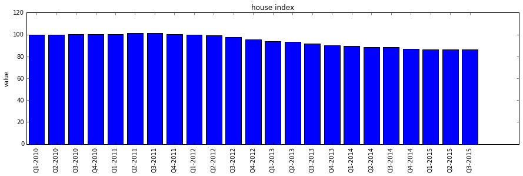

Notebook: using jsonstat.py to explore Istat data
-------------------------------------------------

This Jupyter notebook shows how to use
`jsonstat.py <http://github.com/26fe/jsonstat.py>`__ python library to
explore Istat data. `Istat <http://www.istat.it/en/about-istat>`__ is
Italian National Institute of Statistics. It publishs a rest api for
querying italian statistics.

.. code:: python

    from __future__ import print_function
    import os
    import istat

Setting a cache dir where to store json files download by Istat api.
Storing file on disk speed up development, and assures consistent
results over time. Anyway you can delete file to donwload a fresh copy.

.. code:: python

    cache_dir = os.path.abspath(os.path.join("..", "tmp", "istat_cached"))
    if not os.path.exists(cache_dir):
        os.makedirs(cache_dir)
    print("cache_dir is '{}'".format(cache_dir))

.. parsed-literal::

    cache_dir is '/Users/26fe_nas/prj.python/jsonstat.py/tmp/istat_cached'

List all istat areas

.. code:: python

    istat.cache_dir(cache_dir)
    for istat_area in istat.areas():
        print(istat_area)

.. parsed-literal::

    CEN:2011 Population and housing census
    ENT:Enterprises
    ENV:Environment and Energy
    POP:Population and Households
    HOU:Households Economic Conditions and Disparities
    HEA:Health statistics
    WEL:Social Security and Welfare
    EDU:Education and training
    COM:Communication, culture and leisure
    JUS:Justice and Security
    OPI:Citizens' opinions and satisfaction with life
    SOC:Social participation
    ACC:National Accounts
    AGR:Agriculture
    IND:Industry and Construction
    SER:Services
    PUB:Public Administrations and Private Institutions
    EXT:External Trade and Internationalisation
    PRI:Prices
    LAB:Labour

List all datasets contained into area ``Prices``

.. code:: python

    istat_area_name = 'Prices'
    istat_area = istat.area(istat_area_name)
    
    for istat_dataset in istat_area.datasets():
        print(u"{}({}):{}".format(istat_dataset.cod(), istat_dataset.nrdim(), istat_dataset.name()))

.. parsed-literal::

    DCSP_FOI2B2010(5):FOI – Annual average from 2011  onwards
    DCSP_IPCATC2(5):HICP at constant tax rates – Annual average from 2002 onwards (base 2005=100) 
    DCSP_IPAB(5):House price index 
    DCSC_PREZPRODSERV_1(5):Services producer prices index
    DCSP_NICDUEB2010(5):NIC – Annual average from 2011 onwards
    DCSP_FOI3B2010(4):FOI – Weights from 2011 onwards
    DCSP_NICTRE(4):NIC – Weights  until 2010
    DCSP_FOI2B2015(5):FOI - Annual average from 2016 onwards
    DCSP_FOI1B2015(5):FOI - Monthly data from 2016 onwards
    DCSP_IPCATC1B2015(5):HICP at constant tax rates - Monthly data from 2002 onwards (base 2015=100)
    DCSP_IPCA1B2015(5):HICP - Monthly data from 2001 onwards (base 2015=100)
    DCSP_FOI3B2015(4):FOI - Weights from 2016 onwards
    DCSP_FOI1B2010(5):FOI – Monthly data from 2011 onwards
    DCSP_NICUNOBB2010(5):NIC – Monthly data from 2011 onwards
    DCSP_NIC3B2015(4):NIC - Weights from 2016 onwards
    DCSP_IPCA3(4):HICP – Weights from 2001 onwards
    DCSP_IPCA2(5):HICP – Annual average from 2001 onwards (base 2005=100) 
    DCSC_FABBRESID_1(5):Construction costs index - monthly data
    DCSP_IPCA1(5):HICP – Monthly data from 2001 onwards (base 2005=100)
    DCSP_NICTREB2010(4):NIC – Weights from 2011 onwards
    DCSP_FOI2(5):FOI – Annual average  until 2010
    DCSC_PREZZPIND_1(6):Producer price index for industrial products - monthly data
    DCSP_NICUNOB(5):NIC – Monthly data until 2010
    DCSP_FOI1(5):FOI – Monthly data until 2010
    DCSP_IPCATC1(5):HICP at constant tax rates – Monthly data from 2002 onwards (base 2005=100) 
    DCSP_NIC1B2015(5):NIC - Monthly data from 2016 onwards
    DCSP_NICDUE(5):NIC – Annual average until 2010
    DCSP_FOI3(4):FOI – Weights until 2010

List all dimension for dataset ``DCSP_IPAB`` (House price index)

.. code:: python

    istat_dataset_name = 'DCSP_IPAB'
    istat_dataset = istat_area.dataset(istat_dataset_name)
    istat_dataset.info_dimensions()

.. parsed-literal::

    dim 0 'Territory' (1:'Italy')
    dim 1 'Index type' (18:'house price index (base 2010=100) - quarterly data', 19:'house price index (base 2010=100) - annual average', 20:'house price index (base 2010=100) - weights')
    dim 2 'Measure' (8:'annual average rate of change', 4:'index number', 22:'not applicable', 6:'percentage changes on the previous period', 7:'percentage changes on the same period of the previous year')
    dim 3 'Purchases of dwellings' (4:'H1 - all items', 5:'H11 - new dwellings', 6:'H12 - existing dwellings')
    dim 4 'Time and frequency' (2112:'Q1-2011', 2178:'Q3-2014', 2116:'Q2-2011', 2182:'Q4-2014', 2121:'Q3-2011', 2186:'2015', 2188:'Q1-2015', 2125:'Q4-2011', 2192:'Q2-2015', 2129:'2012', 2131:'Q1-2012', 2197:'Q3-2015', 2135:'Q2-2012', 2140:'Q3-2012', 2144:'Q4-2012', 2148:'2013', 2150:'Q1-2013', 2154:'Q2-2013', 2091:'2010', 2093:'Q1-2010', 2159:'Q3-2013', 2097:'Q2-2010', 2163:'Q4-2013', 2102:'Q3-2010', 2167:'2014', 2169:'Q1-2014', 2106:'Q4-2010', 2173:'Q2-2014', 2110:'2011')

Extract data from dataset ``DCSP_IPAB`` with dimension "1,18,0,0,0"
where the first dimension is Territory, etc. Below is the mapping:

+------------------------+------+-------------------------------------------------------+
| dimension              |      |                                                       |
+========================+======+=======================================================+
| Terrytory              | 1    | Italy                                                 |
+------------------------+------+-------------------------------------------------------+
| Type                   | 18   | house price index (base 2010=100) - quarterly data'   |
+------------------------+------+-------------------------------------------------------+
| Measure                | 0    | ALL                                                   |
+------------------------+------+-------------------------------------------------------+
| Purchase of dwelling   | 0    | ALL                                                   |
+------------------------+------+-------------------------------------------------------+
| Time and frequency     | 0    | ALL                                                   |
+------------------------+------+-------------------------------------------------------+

.. code:: python

    spec = { 
        "Territory": 1, "Index type": 18, 
        # "Measure": 0, # "Purchases of dwelling": 0, # "Time and frequency": 0
    }
    # convert istat dataset into jsonstat collection and print some info
    collection = istat_dataset.getvalues(spec)
    collection.info()

.. parsed-literal::

    0: dataset 'IDMISURA1*IDTYPPURCH*IDTIME'
    

Print some info of one dataset contained into the above jsonstat
collection

.. code:: python

    jsonstat_dataset = collection.dataset('IDMISURA1*IDTYPPURCH*IDTIME')
    jsonstat_dataset

.. parsed-literal::

    name:   'IDMISURA1*IDTYPPURCH*IDTIME'
    label:  'House price index  by Measure, Purchases of dwellings and Time and frequency - Italy - house price index (base 2010=100) - quarterly data'
    size: 207
    3 dimensions:
      0: dim id: 'IDMISURA1' label: 'Measure' size: '3' role: 'None'
      1: dim id: 'IDTYPPURCH' label: 'Purchases of dwellings' size: '3' role: 'None'
      2: dim id: 'IDTIME' label: 'Time and frequency' size: '23' role: 'None'

.. code:: python

    jsonstat_dataset.dimension('IDMISURA1')

.. parsed-literal::

    index
      pos idx      label   
        0 '4'      'index number'
        1 '6'      'percentage changes on the previous period'
        2 '7'      'percentage changes on the same period of the previous year'

.. code:: python

    jsonstat_dataset.dimension('IDTYPPURCH')

.. parsed-literal::

    index
      pos idx      label   
        0 '4'      'H1 - all items'
        1 '5'      'H11 - new dwellings'
        2 '6'      'H12 - existing dwellings'

.. code:: python

    jsonstat_dataset.dimension('IDTIME')

.. parsed-literal::

    index
      pos idx      label   
        0 '2093'   'Q1-2010'
        1 '2097'   'Q2-2010'
        2 '2102'   'Q3-2010'
        3 '2106'   'Q4-2010'
        4 '2112'   'Q1-2011'
        5 '2116'   'Q2-2011'
        6 '2121'   'Q3-2011'
        7 '2125'   'Q4-2011'
        8 '2131'   'Q1-2012'
        9 '2135'   'Q2-2012'
       10 '2140'   'Q3-2012'
       11 '2144'   'Q4-2012'
       12 '2150'   'Q1-2013'
       13 '2154'   'Q2-2013'
       14 '2159'   'Q3-2013'
       15 '2163'   'Q4-2013'
       16 '2169'   'Q1-2014'
       17 '2173'   'Q2-2014'
       18 '2178'   'Q3-2014'
       19 '2182'   'Q4-2014'
       20 '2188'   'Q1-2015'
       21 '2192'   'Q2-2015'
       22 '2197'   'Q3-2015'

.. code:: python

    json_stat_data = istat_dataset.getvalues("1,18,4,4,0")
    json_stat_data

.. parsed-literal::

    0: dataset 'IDTIME'

.. code:: python

    import pandas as pd
    df = jsonstat_dataset.to_table(rtype=pd.DataFrame)
    df.head()

.. raw:: html

    

    <table border="1" class="dataframe">
      <thead>
        <tr style="text-align: right;">
          <th></th>
          <th>Measure</th>
          <th>Purchases of dwellings</th>
          <th>Time and frequency</th>
          <th>Value</th>
        </tr>
      </thead>
      <tbody>
        <tr>
          <th>0</th>
          <td>index number</td>
          <td>H1 - all items</td>
          <td>Q1-2010</td>
          <td>99.5</td>
        </tr>
        <tr>
          <th>1</th>
          <td>index number</td>
          <td>H1 - all items</td>
          <td>Q2-2010</td>
          <td>100.0</td>
        </tr>
        <tr>
          <th>2</th>
          <td>index number</td>
          <td>H1 - all items</td>
          <td>Q3-2010</td>
          <td>100.3</td>
        </tr>
        <tr>
          <th>3</th>
          <td>index number</td>
          <td>H1 - all items</td>
          <td>Q4-2010</td>
          <td>100.2</td>
        </tr>
        <tr>
          <th>4</th>
          <td>index number</td>
          <td>H1 - all items</td>
          <td>Q1-2011</td>
          <td>100.1</td>
        </tr>
      </tbody>
    </table>
    

.. code:: python

    filtered = df.loc[
        (df['Measure'] == 'index number') & (df['Purchases of dwellings'] == 'H1 - all items'), 
        ['Time and frequency', 'Value']
    ]
    filtered.set_index('Time and frequency')

.. raw:: html

    

    <table border="1" class="dataframe">
      <thead>
        <tr style="text-align: right;">
          <th></th>
          <th>Value</th>
        </tr>
        <tr>
          <th>Time and frequency</th>
          <th></th>
        </tr>
      </thead>
      <tbody>
        <tr>
          <th>Q1-2010</th>
          <td>99.5</td>
        </tr>
        <tr>
          <th>Q2-2010</th>
          <td>100.0</td>
        </tr>
        <tr>
          <th>Q3-2010</th>
          <td>100.3</td>
        </tr>
        <tr>
          <th>Q4-2010</th>
          <td>100.2</td>
        </tr>
        <tr>
          <th>Q1-2011</th>
          <td>100.1</td>
        </tr>
        <tr>
          <th>Q2-2011</th>
          <td>101.2</td>
        </tr>
        <tr>
          <th>Q3-2011</th>
          <td>101.2</td>
        </tr>
        <tr>
          <th>Q4-2011</th>
          <td>100.5</td>
        </tr>
        <tr>
          <th>Q1-2012</th>
          <td>99.9</td>
        </tr>
        <tr>
          <th>Q2-2012</th>
          <td>99.1</td>
        </tr>
        <tr>
          <th>Q3-2012</th>
          <td>97.4</td>
        </tr>
        <tr>
          <th>Q4-2012</th>
          <td>95.3</td>
        </tr>
        <tr>
          <th>Q1-2013</th>
          <td>93.9</td>
        </tr>
        <tr>
          <th>Q2-2013</th>
          <td>93.3</td>
        </tr>
        <tr>
          <th>Q3-2013</th>
          <td>91.9</td>
        </tr>
        <tr>
          <th>Q4-2013</th>
          <td>90.2</td>
        </tr>
        <tr>
          <th>Q1-2014</th>
          <td>89.3</td>
        </tr>
        <tr>
          <th>Q2-2014</th>
          <td>88.7</td>
        </tr>
        <tr>
          <th>Q3-2014</th>
          <td>88.3</td>
        </tr>
        <tr>
          <th>Q4-2014</th>
          <td>86.9</td>
        </tr>
        <tr>
          <th>Q1-2015</th>
          <td>86.1</td>
        </tr>
        <tr>
          <th>Q2-2015</th>
          <td>86.1</td>
        </tr>
        <tr>
          <th>Q3-2015</th>
          <td>86.3</td>
        </tr>
      </tbody>
    </table>
    

.. code:: python

    %matplotlib inline
    import matplotlib.pyplot as plt
    
    values = filtered['Value'].tolist()
    labels = filtered['Time and frequency']
    
    xs = [i + 0.1 for i, _ in enumerate(values)]
    # bars are by default width 0.8, so we'll add 0.1 to the left coordinates 
    # so that each bar is centered
    
    # plot bars with left x-coordinates [xs], heights [num_oscars]
    plt.figure(figsize=(15,4))
    plt.bar(xs, values)
    plt.ylabel("value")
    plt.title("house index")
    
    # label x-axis with movie names at bar centers
    plt.xticks([i + 0.5 for i, _ in enumerate(labels)], labels, rotation='vertical') 
    plt.show()

