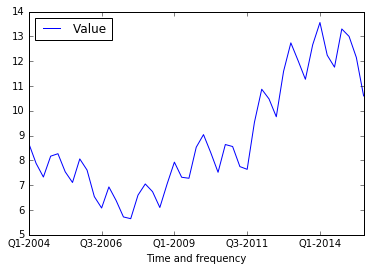
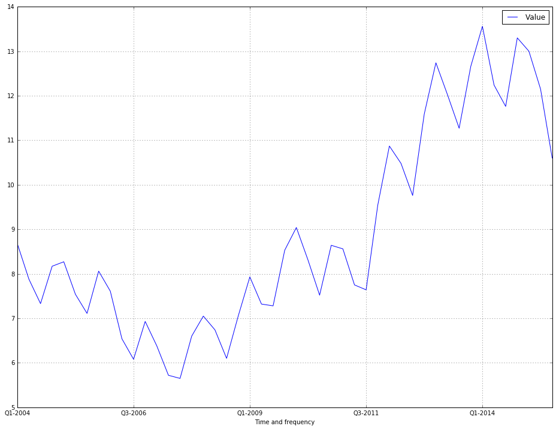
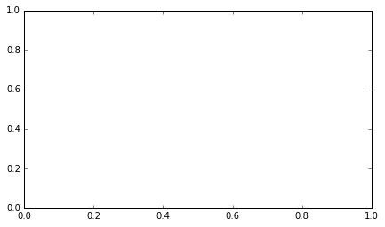

Notebook: using jsonstat.py to explore ISTAT data
-------------------------------------------------

This Jupyter notebook shows how to use
`jsonstat.py <http://github.com/26fe/jsonstat.py>`__ python library to
explore Istat data. `Istat <http://www.istat.it/en/about-istat>`__ is
Italian National Institute of Statistics. It publishs a rest api for
querying italian statistics.

.. code:: python

    from __future__ import print_function
    import os
    import pandas as pd
    import istat
    
    import matplotlib.pyplot as plt
    %matplotlib inline

Setting a cache dir where to store json files download by Istat api.
Storing file on disk speed up development, and assures consistent
results over time. Anyway you can delete file to donwload a fresh copy.

.. code:: python

    cache_dir = os.path.abspath(os.path.join("..", "tmp", "istat_cached"))
    if not os.path.exists(cache_dir):
        os.makedirs(cache_dir)
    print("cache_dir is '{}'".format(cache_dir))

.. parsed-literal::

    cache_dir is '/Users/26fe_nas/prj.python/jsonstat.py/tmp/istat_cached'

List all istat areas

.. code:: python

    istat.cache_dir(cache_dir)
    
    for istat_area in istat.areas():
        print(istat_area)

.. parsed-literal::

    CEN:2011 Population and housing census
    ENT:Enterprises
    ENV:Environment and Energy
    POP:Population and Households
    HOU:Households Economic Conditions and Disparities
    HEA:Health statistics
    WEL:Social Security and Welfare
    EDU:Education and training
    COM:Communication, culture and leisure
    JUS:Justice and Security
    OPI:Citizens' opinions and satisfaction with life
    SOC:Social participation
    ACC:National Accounts
    AGR:Agriculture
    IND:Industry and Construction
    SER:Services
    PUB:Public Administrations and Private Institutions
    EXT:External Trade and Internationalisation
    PRI:Prices
    LAB:Labour

List all datasets contained into area ``LAB`` (Labour)

.. code:: python

    istat_area_name = 'LAB'
    istat_area = istat.area(istat_area_name)
    
    for istat_dataset in istat_area.datasets():
        print(u"{}({}):{}".format(istat_dataset.cod(), istat_dataset.nrdim(), istat_dataset.name()))

.. parsed-literal::

    DCCV_COMPL(12):Supplementary indicators to unemployment
    DCSC_OROS_1(5):Number of payroll jobs index - quarterly data
    DCCV_TAXINATT(8):Inactivity rate
    DCCV_TAXDISOCCUMENS(8):Unemployment rate - monthly data
    DCCV_INATTIVDE(7):Inactive population - seasonally adjusted data
    DCCV_DISOCCUPT(10):Unemployment
    DCSC_GI_COS(6):Labour cost in enterprises with more than 500 employees - monthly data
    DCCV_INATTIV(11):Inactive population
    DCSC_RETRULAOROS_1(5):Gross earnings per full time equivalent unit index - quarterly data
    DCSC_RETRCONTR1T(6):Indicators of bargaining tension - monthly and annual data
    DCSC_RETRCASSCOMPPA(7):Cash and accrual wages according to collective labour agreements per public administration employee per agreement - annual data -  euros
    DCCV_TAXDISOCCUDE(7):Unemployment rate - seasonally adjusted data
    DCSC_RETRCONTR1C(6):Wages according to collective labour agreements by agreement  - monthly and annual data               .
    DCCV_FORZLVMENS(8):Labour force - monthly data
    DCSC_GI_ORE(6):Hours worked in enterprises with more than 500 employees - monthly data
    DCCV_TAXDISOCCU(9):Unemployment rate
    DCCV_OCCUPATIMENS(8):Employed - monthly data
    DCCV_DISOCCUPTDE(7):Unemployed - seasonally adjusted data
    DCSC_COSTLAVSTRUT_1(6):Labour cost survey (four-yearly survey)
    DCCV_TAXATVTMENS(8):Activity rate - monthly data
    DCCV_ORELAVMED(12):Employment by number of actual weekly hours and average number of actual weekly hours
    DCSC_RETRATECO1(6):Wages according to collective labour agreements by Nace rev.2
    DCCV_FORZLVDE(7):Labour force - seasonally adjusted data
    DCIS_RICSTAT(6):New series of estimates on the resident population at NUTS-2 level for the 1/1/2002-1/1/2014 period
    DCCV_TAXINATTMENS(8):Inactivity rate - monthly data
    DCCV_NEET(10):Young people not in employment, education or training
    DCCV_OCCUPATITDE(8):Employed - seasonally adjusted data
    DCCV_TAXOCCUDE(7):Employment rate - seasonally adjusted data
    DCSC_ORE10_1(5):Hours worked in enterprises with at least 10 employees - quarterly data
    DCSC_POSTIVAC_1(5):Job vacancy rate - quarterly data
    DCCV_TAXATVTDE(7):Activity rate - seasonally adjusted data
    DCCV_OCCUPATIT(14): Employment                                
    DCSC_GI_RE(6):Gross earnings in enterprises with more than 500 employees - monthly data
    DCSC_RETRCONTR1O(6):Annual gross, net hours, holiday pay and other hours reduction according to collective labour agreements
    DCCV_INATTIVMENS(8):Inactive population - monthly data
    DCCV_TAXATVT(8):Activity rate
    DCCV_TAXOCCUMENS(8):Employment rate - monthly data
    DCCV_DISOCCUPTMENS(8):Unemployed - monthly data
    DCCV_TAXINATTDE(7):Inactivity rate - seasonally adjusted data
    DCSC_GI_OCC(6):Employment, inflow and outflow rates in enterprises with more than 500 employees - monthly data
    DCSC_COSTLAVULAOROS_1(5):Labour cost per full time equivalent unit indicators - quarterly data
    DCCV_FORZLV(8):Labour force
    DCCV_TAXOCCU(8):Employment rate

List all dimension for dataset ``DCCV_TAXDISOCCU`` (Unemployment rate)

.. code:: python

    istat_dataset_name = 'DCCV_TAXDISOCCU'
    istat_dataset = istat_area.dataset(istat_dataset_name)
    istat_dataset.info_dimensions()

.. parsed-literal::

    dim 0 'Territory' (1:'Italy', 3:'Nord', 4:'Nord-ovest', 5:'Piemonte', 6:'Torino', 7:'Vercelli', 8:'Biella', 9:'Verbano-Cusio-Ossola', 10:'Novara', 11:'Cuneo', 12:'Asti', 13:'Alessandria', 14:'Valle d'Aosta / Vallée d'Aoste', 15:'Valle d'Aosta / Vallée d'Aoste', 16:'Liguria', 17:'Imperia', 18:'Savona', 19:'Genova', 20:'La Spezia', 21:'Lombardia', 22:'Varese', 23:'Como', 24:'Lecco', 25:'Sondrio', 26:'Milano', 27:'Bergamo', 28:'Brescia', 29:'Pavia', 30:'Lodi', 31:'Cremona', 32:'Mantova', 33:'Nord-est', 34:'Trentino Alto Adige / Südtirol', 35:'Provincia Autonoma Bolzano / Bozen', 37:'Provincia Autonoma Trento', 39:'Veneto', 40:'Verona', 41:'Vicenza', 42:'Belluno', 43:'Treviso', 44:'Venezia', 45:'Padova', 46:'Rovigo', 47:'Friuli-Venezia Giulia', 48:'Pordenone', 49:'Udine', 50:'Gorizia', 51:'Trieste', 52:'Emilia-Romagna', 53:'Piacenza', 54:'Parma', 55:'Reggio nell'Emilia', 56:'Modena', 57:'Bologna', 58:'Ferrara', 59:'Ravenna', 60:'Forlì-Cesena', 61:'Rimini', 62:'Centro (I)', 63:'Toscana', 64:'Massa-Carrara', 65:'Lucca', 66:'Pistoia', 67:'Firenze', 68:'Prato', 69:'Livorno', 70:'Pisa', 71:'Arezzo', 72:'Siena', 73:'Grosseto', 74:'Umbria', 75:'Perugia', 76:'Terni', 77:'Marche', 78:'Pesaro e Urbino', 79:'Ancona', 80:'Macerata', 81:'Ascoli Piceno', 82:'Lazio', 83:'Viterbo', 84:'Rieti', 85:'Roma', 86:'Latina', 87:'Frosinone', 88:'Mezzogiorno', 90:'Abruzzo', 91:'L'Aquila', 92:'Teramo', 93:'Pescara', 94:'Chieti', 95:'Molise', 96:'Isernia', 97:'Campobasso', 98:'Campania', 99:'Caserta', 100:'Benevento', 101:'Napoli', 102:'Avellino', 103:'Salerno', 104:'Puglia', 105:'Foggia', 106:'Bari', 107:'Taranto', 108:'Brindisi', 109:'Lecce', 110:'Basilicata', 111:'Potenza', 112:'Matera', 113:'Calabria', 114:'Cosenza', 115:'Crotone', 116:'Catanzaro', 117:'Vibo Valentia', 118:'Reggio di Calabria', 120:'Sicilia', 121:'Trapani', 122:'Palermo', 123:'Messina', 124:'Agrigento', 125:'Caltanissetta', 126:'Enna', 127:'Catania', 128:'Ragusa', 129:'Siracusa', 130:'Sardegna', 131:'Sassari', 132:'Nuoro', 133:'Cagliari', 134:'Oristano', 135:'Olbia-Tempio', 136:'Ogliastra', 137:'Medio Campidano', 138:'Carbonia-Iglesias', 146:'Monza e della Brianza', 147:'Fermo', 148:'Barletta-Andria-Trani')
    dim 1 'Data type' (6:'unemployment rate')
    dim 2 'Measure' (1:'percentage values')
    dim 3 'Gender' (1:'males', 2:'females', 3:'total')
    dim 4 'Age class' (32:'18-29 years', 3:'20-24 years', 4:'15-24 years', 8:'25-34 years', 9:'35-54 years', 11:'35 years and over', 14:'35-44 years', 17:'45-54 years', 19:'55 years and over', 21:'55-64 years', 22:'15-64 years', 28:'15 years and over', 30:'15-29 years', 31:'15-74 years')
    dim 5 'Highest level of education attained' (11:'tertiary (university, doctoral and specialization courses)', 12:'total', 3:'primary school certificate, no educational degree', 4:'lower secondary school certificate', 7:'upper and post secondary')
    dim 6 'Citizenship' (1:'italian', 2:'foreign', 3:'total')
    dim 7 'Duration of unemployment' (2:'12 months and more', 3:'total')
    dim 8 'Time and frequency' (1536:'Q4-1980', 2049:'Q4-2007', 1540:'1981', 2053:'2008', 1542:'Q1-1981', 2055:'Q1-2008', 1546:'Q2-1981', 2059:'Q2-2008', 1551:'Q3-1981', 2064:'Q3-2008', 1555:'Q4-1981', 2068:'Q4-2008', 1559:'1982', 2072:'2009', 1561:'Q1-1982', 2074:'Q1-2009', 1565:'Q2-1982', 2078:'Q2-2009', 1570:'Q3-1982', 2083:'Q3-2009', 1574:'Q4-1982', 2087:'Q4-2009', 1578:'1983', 2091:'2010', 1580:'Q1-1983', 2093:'Q1-2010', 1584:'Q2-1983', 2097:'Q2-2010', 1589:'Q3-1983', 2102:'Q3-2010', 1593:'Q4-1983', 2106:'Q4-2010', 1597:'1984', 2110:'2011', 1599:'Q1-1984', 2112:'Q1-2011', 1603:'Q2-1984', 2116:'Q2-2011', 1608:'Q3-1984', 2121:'Q3-2011', 1612:'Q4-1984', 2125:'Q4-2011', 1616:'1985', 2129:'2012', 1618:'Q1-1985', 2131:'Q1-2012', 1622:'Q2-1985', 2135:'Q2-2012', 1627:'Q3-1985', 2140:'Q3-2012', 1631:'Q4-1985', 2144:'Q4-2012', 1635:'1986', 2148:'2013', 1637:'Q1-1986', 2150:'Q1-2013', 1641:'Q2-1986', 2154:'Q2-2013', 1646:'Q3-1986', 2159:'Q3-2013', 1650:'Q4-1986', 2163:'Q4-2013', 1654:'1987', 2167:'2014', 1656:'Q1-1987', 2169:'Q1-2014', 1660:'Q2-1987', 2173:'Q2-2014', 1665:'Q3-1987', 2178:'Q3-2014', 1669:'Q4-1987', 2182:'Q4-2014', 1673:'1988', 1675:'Q1-1988', 2188:'Q1-2015', 1679:'Q2-1988', 2192:'Q2-2015', 1684:'Q3-1988', 2197:'Q3-2015', 1688:'Q4-1988', 1692:'1989', 1694:'Q1-1989', 1698:'Q2-1989', 1703:'Q3-1989', 1707:'Q4-1989', 1711:'1990', 1713:'Q1-1990', 1717:'Q2-1990', 1722:'Q3-1990', 1726:'Q4-1990', 1730:'1991', 1732:'Q1-1991', 1736:'Q2-1991', 1741:'Q3-1991', 1745:'Q4-1991', 1749:'1992', 1751:'Q1-1992', 1755:'Q2-1992', 1760:'Q3-1992', 1764:'Q4-1992', 1768:'1993', 1770:'Q1-1993', 1774:'Q2-1993', 1779:'Q3-1993', 1783:'Q4-1993', 1787:'1994', 1789:'Q1-1994', 1793:'Q2-1994', 1798:'Q3-1994', 1802:'Q4-1994', 1806:'1995', 1808:'Q1-1995', 1812:'Q2-1995', 1817:'Q3-1995', 1821:'Q4-1995', 1825:'1996', 1827:'Q1-1996', 1831:'Q2-1996', 1836:'Q3-1996', 1840:'Q4-1996', 1844:'1997', 1846:'Q1-1997', 1850:'Q2-1997', 1855:'Q3-1997', 1859:'Q4-1997', 1863:'1998', 1865:'Q1-1998', 1869:'Q2-1998', 1874:'Q3-1998', 1878:'Q4-1998', 1882:'1999', 1884:'Q1-1999', 1888:'Q2-1999', 1893:'Q3-1999', 1897:'Q4-1999', 1901:'2000', 1903:'Q1-2000', 1907:'Q2-2000', 1912:'Q3-2000', 1916:'Q4-2000', 1920:'2001', 1922:'Q1-2001', 1926:'Q2-2001', 1931:'Q3-2001', 1935:'Q4-2001', 1939:'2002', 1941:'Q1-2002', 1945:'Q2-2002', 1950:'Q3-2002', 1954:'Q4-2002', 1958:'2003', 1960:'Q1-2003', 1964:'Q2-2003', 1969:'Q3-2003', 1973:'Q4-2003', 1464:'1977', 1977:'2004', 1466:'Q1-1977', 1979:'Q1-2004', 1470:'Q2-1977', 1983:'Q2-2004', 1475:'Q3-1977', 1988:'Q3-2004', 1479:'Q4-1977', 1992:'Q4-2004', 1483:'1978', 1996:'2005', 1485:'Q1-1978', 1998:'Q1-2005', 1489:'Q2-1978', 2002:'Q2-2005', 1494:'Q3-1978', 2007:'Q3-2005', 1498:'Q4-1978', 2011:'Q4-2005', 1502:'1979', 2015:'2006', 1504:'Q1-1979', 2017:'Q1-2006', 1508:'Q2-1979', 2021:'Q2-2006', 1513:'Q3-1979', 2026:'Q3-2006', 1517:'Q4-1979', 2030:'Q4-2006', 1521:'1980', 2034:'2007', 1523:'Q1-1980', 2036:'Q1-2007', 1527:'Q2-1980', 2040:'Q2-2007', 1532:'Q3-1980', 2045:'Q3-2007')

Extract data from dataset ``DCCV_TAXDISOCCU``

.. code:: python

    spec = { 
        "Territory": 0, # 1 Italy
        "Data type": 6, # 
        'Measure': 1,
        'Gender': 3,
        'Age class':31, # (32:'18-29 years', 
                        # 3:'20-24 years', 
                        # 4:'15-24 years', 
                        # 8:'25-34 years', 
                        # 9:'35-54 years', 
                        # 11:'35 years and over', 
                        # 14:'35-44 years', 
                        # 17:'45-54 years', 
                        # 19:'55 years and over', 
                        # 21:'55-64 years', 
                        # 22:'15-64 years', 
                        # 28:'15 years and over', 
                        # 30:'15-29 years', 
                        # 31:'15-74 years')
        'Highest level of education attained': 12,
                        #(11:'tertiary (university, doctoral and specialization courses)', 
                        # 12:'total', 
                        # 3:'primary school certificate, no educational degree', 
                        # 4:'lower secondary school certificate', 
                        # 7:'upper and post secondary')
        'Citizenship': 3, # (1:'italian', 2:'foreign', 3:'total')
        'Duration of unemployment': 3, # (2:'12 months and more', 3:'total')
        'Time and frequency': 0 # All
    }
    
    # convert istat dataset into jsonstat collection and print some info
    collection = istat_dataset.getvalues(spec)
    collection.info()

.. parsed-literal::

    0: dataset 'IDITTER107*IDTIME'
    

Print some info of one dataset contained into the above jsonstat
collection

.. code:: python

    jsonstat_dataset = collection.dataset(0)
    jsonstat_dataset

.. parsed-literal::

    name:   'IDITTER107*IDTIME'
    label:  'Unemployment rate by Territory and Time and frequency - unemployment rate - percentage values - 15-74 years'
    size: 7830
    2 dimensions:
      0: dim id: 'IDITTER107' label: 'Territory' size: '135' role: 'None'
      1: dim id: 'IDTIME' label: 'Time and frequency' size: '58' role: 'None'

.. code:: python

    df_all = jsonstat_dataset.to_table(rtype=pd.DataFrame)
    df_all

.. raw:: html

    

    <table border="1" class="dataframe">
      <thead>
        <tr style="text-align: right;">
          <th></th>
          <th>Territory</th>
          <th>Time and frequency</th>
          <th>Value</th>
        </tr>
      </thead>
      <tbody>
        <tr>
          <th>0</th>
          <td>Italy</td>
          <td>2004</td>
          <td>8.01</td>
        </tr>
        <tr>
          <th>1</th>
          <td>Italy</td>
          <td>Q1-2004</td>
          <td>8.68</td>
        </tr>
        <tr>
          <th>2</th>
          <td>Italy</td>
          <td>Q2-2004</td>
          <td>7.88</td>
        </tr>
        <tr>
          <th>3</th>
          <td>Italy</td>
          <td>Q3-2004</td>
          <td>7.33</td>
        </tr>
        <tr>
          <th>4</th>
          <td>Italy</td>
          <td>Q4-2004</td>
          <td>8.17</td>
        </tr>
        <tr>
          <th>5</th>
          <td>Italy</td>
          <td>2005</td>
          <td>7.74</td>
        </tr>
        <tr>
          <th>6</th>
          <td>Italy</td>
          <td>Q1-2005</td>
          <td>8.27</td>
        </tr>
        <tr>
          <th>7</th>
          <td>Italy</td>
          <td>Q2-2005</td>
          <td>7.54</td>
        </tr>
        <tr>
          <th>8</th>
          <td>Italy</td>
          <td>Q3-2005</td>
          <td>7.11</td>
        </tr>
        <tr>
          <th>9</th>
          <td>Italy</td>
          <td>Q4-2005</td>
          <td>8.06</td>
        </tr>
        <tr>
          <th>10</th>
          <td>Italy</td>
          <td>2006</td>
          <td>6.79</td>
        </tr>
        <tr>
          <th>11</th>
          <td>Italy</td>
          <td>Q1-2006</td>
          <td>7.61</td>
        </tr>
        <tr>
          <th>12</th>
          <td>Italy</td>
          <td>Q2-2006</td>
          <td>6.54</td>
        </tr>
        <tr>
          <th>13</th>
          <td>Italy</td>
          <td>Q3-2006</td>
          <td>6.08</td>
        </tr>
        <tr>
          <th>14</th>
          <td>Italy</td>
          <td>Q4-2006</td>
          <td>6.93</td>
        </tr>
        <tr>
          <th>15</th>
          <td>Italy</td>
          <td>2007</td>
          <td>6.09</td>
        </tr>
        <tr>
          <th>16</th>
          <td>Italy</td>
          <td>Q1-2007</td>
          <td>6.38</td>
        </tr>
        <tr>
          <th>17</th>
          <td>Italy</td>
          <td>Q2-2007</td>
          <td>5.72</td>
        </tr>
        <tr>
          <th>18</th>
          <td>Italy</td>
          <td>Q3-2007</td>
          <td>5.65</td>
        </tr>
        <tr>
          <th>19</th>
          <td>Italy</td>
          <td>Q4-2007</td>
          <td>6.60</td>
        </tr>
        <tr>
          <th>20</th>
          <td>Italy</td>
          <td>2008</td>
          <td>6.74</td>
        </tr>
        <tr>
          <th>21</th>
          <td>Italy</td>
          <td>Q1-2008</td>
          <td>7.05</td>
        </tr>
        <tr>
          <th>22</th>
          <td>Italy</td>
          <td>Q2-2008</td>
          <td>6.74</td>
        </tr>
        <tr>
          <th>23</th>
          <td>Italy</td>
          <td>Q3-2008</td>
          <td>6.10</td>
        </tr>
        <tr>
          <th>24</th>
          <td>Italy</td>
          <td>Q4-2008</td>
          <td>7.05</td>
        </tr>
        <tr>
          <th>25</th>
          <td>Italy</td>
          <td>2009</td>
          <td>7.76</td>
        </tr>
        <tr>
          <th>26</th>
          <td>Italy</td>
          <td>Q1-2009</td>
          <td>7.93</td>
        </tr>
        <tr>
          <th>27</th>
          <td>Italy</td>
          <td>Q2-2009</td>
          <td>7.32</td>
        </tr>
        <tr>
          <th>28</th>
          <td>Italy</td>
          <td>Q3-2009</td>
          <td>7.28</td>
        </tr>
        <tr>
          <th>29</th>
          <td>Italy</td>
          <td>Q4-2009</td>
          <td>8.53</td>
        </tr>
        <tr>
          <th>...</th>
          <td>...</td>
          <td>...</td>
          <td>...</td>
        </tr>
        <tr>
          <th>7800</th>
          <td>Barletta-Andria-Trani</td>
          <td>Q3-2009</td>
          <td>NaN</td>
        </tr>
        <tr>
          <th>7801</th>
          <td>Barletta-Andria-Trani</td>
          <td>Q4-2009</td>
          <td>NaN</td>
        </tr>
        <tr>
          <th>7802</th>
          <td>Barletta-Andria-Trani</td>
          <td>2010</td>
          <td>13.12</td>
        </tr>
        <tr>
          <th>7803</th>
          <td>Barletta-Andria-Trani</td>
          <td>Q1-2010</td>
          <td>NaN</td>
        </tr>
        <tr>
          <th>7804</th>
          <td>Barletta-Andria-Trani</td>
          <td>Q2-2010</td>
          <td>NaN</td>
        </tr>
        <tr>
          <th>7805</th>
          <td>Barletta-Andria-Trani</td>
          <td>Q3-2010</td>
          <td>NaN</td>
        </tr>
        <tr>
          <th>7806</th>
          <td>Barletta-Andria-Trani</td>
          <td>Q4-2010</td>
          <td>NaN</td>
        </tr>
        <tr>
          <th>7807</th>
          <td>Barletta-Andria-Trani</td>
          <td>2011</td>
          <td>12.81</td>
        </tr>
        <tr>
          <th>7808</th>
          <td>Barletta-Andria-Trani</td>
          <td>Q1-2011</td>
          <td>NaN</td>
        </tr>
        <tr>
          <th>7809</th>
          <td>Barletta-Andria-Trani</td>
          <td>Q2-2011</td>
          <td>NaN</td>
        </tr>
        <tr>
          <th>7810</th>
          <td>Barletta-Andria-Trani</td>
          <td>Q3-2011</td>
          <td>NaN</td>
        </tr>
        <tr>
          <th>7811</th>
          <td>Barletta-Andria-Trani</td>
          <td>Q4-2011</td>
          <td>NaN</td>
        </tr>
        <tr>
          <th>7812</th>
          <td>Barletta-Andria-Trani</td>
          <td>2012</td>
          <td>11.81</td>
        </tr>
        <tr>
          <th>7813</th>
          <td>Barletta-Andria-Trani</td>
          <td>Q1-2012</td>
          <td>NaN</td>
        </tr>
        <tr>
          <th>7814</th>
          <td>Barletta-Andria-Trani</td>
          <td>Q2-2012</td>
          <td>NaN</td>
        </tr>
        <tr>
          <th>7815</th>
          <td>Barletta-Andria-Trani</td>
          <td>Q3-2012</td>
          <td>NaN</td>
        </tr>
        <tr>
          <th>7816</th>
          <td>Barletta-Andria-Trani</td>
          <td>Q4-2012</td>
          <td>NaN</td>
        </tr>
        <tr>
          <th>7817</th>
          <td>Barletta-Andria-Trani</td>
          <td>2013</td>
          <td>22.22</td>
        </tr>
        <tr>
          <th>7818</th>
          <td>Barletta-Andria-Trani</td>
          <td>Q1-2013</td>
          <td>NaN</td>
        </tr>
        <tr>
          <th>7819</th>
          <td>Barletta-Andria-Trani</td>
          <td>Q2-2013</td>
          <td>NaN</td>
        </tr>
        <tr>
          <th>7820</th>
          <td>Barletta-Andria-Trani</td>
          <td>Q3-2013</td>
          <td>NaN</td>
        </tr>
        <tr>
          <th>7821</th>
          <td>Barletta-Andria-Trani</td>
          <td>Q4-2013</td>
          <td>NaN</td>
        </tr>
        <tr>
          <th>7822</th>
          <td>Barletta-Andria-Trani</td>
          <td>2014</td>
          <td>21.24</td>
        </tr>
        <tr>
          <th>7823</th>
          <td>Barletta-Andria-Trani</td>
          <td>Q1-2014</td>
          <td>NaN</td>
        </tr>
        <tr>
          <th>7824</th>
          <td>Barletta-Andria-Trani</td>
          <td>Q2-2014</td>
          <td>NaN</td>
        </tr>
        <tr>
          <th>7825</th>
          <td>Barletta-Andria-Trani</td>
          <td>Q3-2014</td>
          <td>NaN</td>
        </tr>
        <tr>
          <th>7826</th>
          <td>Barletta-Andria-Trani</td>
          <td>Q4-2014</td>
          <td>NaN</td>
        </tr>
        <tr>
          <th>7827</th>
          <td>Barletta-Andria-Trani</td>
          <td>Q1-2015</td>
          <td>NaN</td>
        </tr>
        <tr>
          <th>7828</th>
          <td>Barletta-Andria-Trani</td>
          <td>Q2-2015</td>
          <td>NaN</td>
        </tr>
        <tr>
          <th>7829</th>
          <td>Barletta-Andria-Trani</td>
          <td>Q3-2015</td>
          <td>NaN</td>
        </tr>
      </tbody>
    </table>
    
7830 rows × 3 columns

    

.. code:: python

    df_all.pivot('Territory', 	'Time and frequency', 	'Value')

.. raw:: html

    

    <table border="1" class="dataframe">
      <thead>
        <tr style="text-align: right;">
          <th>Time and frequency</th>
          <th>2004</th>
          <th>2005</th>
          <th>2006</th>
          <th>2007</th>
          <th>2008</th>
          <th>2009</th>
          <th>2010</th>
          <th>2011</th>
          <th>2012</th>
          <th>2013</th>
          <th>...</th>
          <th>Q4-2005</th>
          <th>Q4-2006</th>
          <th>Q4-2007</th>
          <th>Q4-2008</th>
          <th>Q4-2009</th>
          <th>Q4-2010</th>
          <th>Q4-2011</th>
          <th>Q4-2012</th>
          <th>Q4-2013</th>
          <th>Q4-2014</th>
        </tr>
        <tr>
          <th>Territory</th>
          <th></th>
          <th></th>
          <th></th>
          <th></th>
          <th></th>
          <th></th>
          <th></th>
          <th></th>
          <th></th>
          <th></th>
          <th></th>
          <th></th>
          <th></th>
          <th></th>
          <th></th>
          <th></th>
          <th></th>
          <th></th>
          <th></th>
          <th></th>
          <th></th>
        </tr>
      </thead>
      <tbody>
        <tr>
          <th>Abruzzo</th>
          <td>7.71</td>
          <td>7.88</td>
          <td>6.57</td>
          <td>6.17</td>
          <td>6.63</td>
          <td>7.97</td>
          <td>8.67</td>
          <td>8.59</td>
          <td>10.85</td>
          <td>11.29</td>
          <td>...</td>
          <td>6.95</td>
          <td>6.84</td>
          <td>5.87</td>
          <td>6.67</td>
          <td>7.02</td>
          <td>9.15</td>
          <td>9.48</td>
          <td>10.48</td>
          <td>11.21</td>
          <td>12.08</td>
        </tr>
        <tr>
          <th>Agrigento</th>
          <td>20.18</td>
          <td>17.62</td>
          <td>13.40</td>
          <td>16.91</td>
          <td>16.72</td>
          <td>17.43</td>
          <td>19.42</td>
          <td>17.61</td>
          <td>19.48</td>
          <td>20.98</td>
          <td>...</td>
          <td>NaN</td>
          <td>NaN</td>
          <td>NaN</td>
          <td>NaN</td>
          <td>NaN</td>
          <td>NaN</td>
          <td>NaN</td>
          <td>NaN</td>
          <td>NaN</td>
          <td>NaN</td>
        </tr>
        <tr>
          <th>Alessandria</th>
          <td>5.34</td>
          <td>5.37</td>
          <td>4.65</td>
          <td>4.63</td>
          <td>4.85</td>
          <td>5.81</td>
          <td>5.34</td>
          <td>6.66</td>
          <td>10.48</td>
          <td>11.80</td>
          <td>...</td>
          <td>NaN</td>
          <td>NaN</td>
          <td>NaN</td>
          <td>NaN</td>
          <td>NaN</td>
          <td>NaN</td>
          <td>NaN</td>
          <td>NaN</td>
          <td>NaN</td>
          <td>NaN</td>
        </tr>
        <tr>
          <th>Ancona</th>
          <td>5.11</td>
          <td>4.14</td>
          <td>4.05</td>
          <td>3.49</td>
          <td>3.78</td>
          <td>5.82</td>
          <td>4.94</td>
          <td>6.84</td>
          <td>9.20</td>
          <td>11.27</td>
          <td>...</td>
          <td>NaN</td>
          <td>NaN</td>
          <td>NaN</td>
          <td>NaN</td>
          <td>NaN</td>
          <td>NaN</td>
          <td>NaN</td>
          <td>NaN</td>
          <td>NaN</td>
          <td>NaN</td>
        </tr>
        <tr>
          <th>Arezzo</th>
          <td>4.55</td>
          <td>5.50</td>
          <td>4.88</td>
          <td>4.61</td>
          <td>4.91</td>
          <td>5.51</td>
          <td>5.87</td>
          <td>6.04</td>
          <td>7.33</td>
          <td>8.04</td>
          <td>...</td>
          <td>NaN</td>
          <td>NaN</td>
          <td>NaN</td>
          <td>NaN</td>
          <td>NaN</td>
          <td>NaN</td>
          <td>NaN</td>
          <td>NaN</td>
          <td>NaN</td>
          <td>NaN</td>
        </tr>
        <tr>
          <th>Ascoli Piceno</th>
          <td>5.60</td>
          <td>6.70</td>
          <td>6.37</td>
          <td>5.53</td>
          <td>5.93</td>
          <td>9.52</td>
          <td>8.84</td>
          <td>10.95</td>
          <td>12.23</td>
          <td>11.37</td>
          <td>...</td>
          <td>NaN</td>
          <td>NaN</td>
          <td>NaN</td>
          <td>NaN</td>
          <td>NaN</td>
          <td>NaN</td>
          <td>NaN</td>
          <td>NaN</td>
          <td>NaN</td>
          <td>NaN</td>
        </tr>
        <tr>
          <th>Asti</th>
          <td>5.02</td>
          <td>5.01</td>
          <td>4.14</td>
          <td>3.23</td>
          <td>4.25</td>
          <td>5.83</td>
          <td>6.34</td>
          <td>5.52</td>
          <td>7.62</td>
          <td>9.59</td>
          <td>...</td>
          <td>NaN</td>
          <td>NaN</td>
          <td>NaN</td>
          <td>NaN</td>
          <td>NaN</td>
          <td>NaN</td>
          <td>NaN</td>
          <td>NaN</td>
          <td>NaN</td>
          <td>NaN</td>
        </tr>
        <tr>
          <th>Avellino</th>
          <td>11.21</td>
          <td>13.34</td>
          <td>10.90</td>
          <td>9.25</td>
          <td>9.74</td>
          <td>8.06</td>
          <td>11.79</td>
          <td>14.06</td>
          <td>15.32</td>
          <td>13.67</td>
          <td>...</td>
          <td>NaN</td>
          <td>NaN</td>
          <td>NaN</td>
          <td>NaN</td>
          <td>NaN</td>
          <td>NaN</td>
          <td>NaN</td>
          <td>NaN</td>
          <td>NaN</td>
          <td>NaN</td>
        </tr>
        <tr>
          <th>Bari</th>
          <td>14.51</td>
          <td>13.46</td>
          <td>13.20</td>
          <td>9.55</td>
          <td>10.28</td>
          <td>11.07</td>
          <td>11.14</td>
          <td>12.17</td>
          <td>16.01</td>
          <td>19.68</td>
          <td>...</td>
          <td>NaN</td>
          <td>NaN</td>
          <td>NaN</td>
          <td>NaN</td>
          <td>NaN</td>
          <td>NaN</td>
          <td>NaN</td>
          <td>NaN</td>
          <td>NaN</td>
          <td>NaN</td>
        </tr>
        <tr>
          <th>Barletta-Andria-Trani</th>
          <td>NaN</td>
          <td>NaN</td>
          <td>NaN</td>
          <td>NaN</td>
          <td>NaN</td>
          <td>NaN</td>
          <td>13.12</td>
          <td>12.81</td>
          <td>11.81</td>
          <td>22.22</td>
          <td>...</td>
          <td>NaN</td>
          <td>NaN</td>
          <td>NaN</td>
          <td>NaN</td>
          <td>NaN</td>
          <td>NaN</td>
          <td>NaN</td>
          <td>NaN</td>
          <td>NaN</td>
          <td>NaN</td>
        </tr>
        <tr>
          <th>Basilicata</th>
          <td>12.90</td>
          <td>12.31</td>
          <td>10.58</td>
          <td>9.45</td>
          <td>11.00</td>
          <td>11.23</td>
          <td>12.91</td>
          <td>11.90</td>
          <td>14.55</td>
          <td>15.26</td>
          <td>...</td>
          <td>12.95</td>
          <td>8.71</td>
          <td>9.10</td>
          <td>11.47</td>
          <td>13.50</td>
          <td>12.15</td>
          <td>12.42</td>
          <td>12.72</td>
          <td>16.53</td>
          <td>14.04</td>
        </tr>
        <tr>
          <th>Belluno</th>
          <td>2.66</td>
          <td>3.79</td>
          <td>2.28</td>
          <td>2.19</td>
          <td>2.46</td>
          <td>4.30</td>
          <td>4.53</td>
          <td>4.56</td>
          <td>6.07</td>
          <td>7.05</td>
          <td>...</td>
          <td>NaN</td>
          <td>NaN</td>
          <td>NaN</td>
          <td>NaN</td>
          <td>NaN</td>
          <td>NaN</td>
          <td>NaN</td>
          <td>NaN</td>
          <td>NaN</td>
          <td>NaN</td>
        </tr>
        <tr>
          <th>Benevento</th>
          <td>12.68</td>
          <td>12.79</td>
          <td>10.96</td>
          <td>9.69</td>
          <td>10.06</td>
          <td>11.18</td>
          <td>11.59</td>
          <td>10.64</td>
          <td>14.60</td>
          <td>16.91</td>
          <td>...</td>
          <td>NaN</td>
          <td>NaN</td>
          <td>NaN</td>
          <td>NaN</td>
          <td>NaN</td>
          <td>NaN</td>
          <td>NaN</td>
          <td>NaN</td>
          <td>NaN</td>
          <td>NaN</td>
        </tr>
        <tr>
          <th>Bergamo</th>
          <td>3.54</td>
          <td>3.26</td>
          <td>3.00</td>
          <td>2.48</td>
          <td>2.97</td>
          <td>3.67</td>
          <td>3.73</td>
          <td>4.08</td>
          <td>6.91</td>
          <td>7.43</td>
          <td>...</td>
          <td>NaN</td>
          <td>NaN</td>
          <td>NaN</td>
          <td>NaN</td>
          <td>NaN</td>
          <td>NaN</td>
          <td>NaN</td>
          <td>NaN</td>
          <td>NaN</td>
          <td>NaN</td>
        </tr>
        <tr>
          <th>Biella</th>
          <td>5.13</td>
          <td>5.34</td>
          <td>4.84</td>
          <td>4.24</td>
          <td>4.85</td>
          <td>6.65</td>
          <td>8.07</td>
          <td>8.28</td>
          <td>8.79</td>
          <td>9.67</td>
          <td>...</td>
          <td>NaN</td>
          <td>NaN</td>
          <td>NaN</td>
          <td>NaN</td>
          <td>NaN</td>
          <td>NaN</td>
          <td>NaN</td>
          <td>NaN</td>
          <td>NaN</td>
          <td>NaN</td>
        </tr>
        <tr>
          <th>Bologna</th>
          <td>2.96</td>
          <td>2.85</td>
          <td>2.96</td>
          <td>2.45</td>
          <td>2.18</td>
          <td>3.41</td>
          <td>4.91</td>
          <td>4.66</td>
          <td>6.86</td>
          <td>8.20</td>
          <td>...</td>
          <td>NaN</td>
          <td>NaN</td>
          <td>NaN</td>
          <td>NaN</td>
          <td>NaN</td>
          <td>NaN</td>
          <td>NaN</td>
          <td>NaN</td>
          <td>NaN</td>
          <td>NaN</td>
        </tr>
        <tr>
          <th>Brescia</th>
          <td>3.50</td>
          <td>4.19</td>
          <td>3.78</td>
          <td>3.16</td>
          <td>3.16</td>
          <td>5.19</td>
          <td>5.67</td>
          <td>5.79</td>
          <td>6.75</td>
          <td>8.35</td>
          <td>...</td>
          <td>NaN</td>
          <td>NaN</td>
          <td>NaN</td>
          <td>NaN</td>
          <td>NaN</td>
          <td>NaN</td>
          <td>NaN</td>
          <td>NaN</td>
          <td>NaN</td>
          <td>NaN</td>
        </tr>
        <tr>
          <th>Brindisi</th>
          <td>15.94</td>
          <td>16.08</td>
          <td>12.74</td>
          <td>13.55</td>
          <td>12.35</td>
          <td>14.38</td>
          <td>14.70</td>
          <td>12.91</td>
          <td>13.20</td>
          <td>16.82</td>
          <td>...</td>
          <td>NaN</td>
          <td>NaN</td>
          <td>NaN</td>
          <td>NaN</td>
          <td>NaN</td>
          <td>NaN</td>
          <td>NaN</td>
          <td>NaN</td>
          <td>NaN</td>
          <td>NaN</td>
        </tr>
        <tr>
          <th>Cagliari</th>
          <td>15.71</td>
          <td>12.93</td>
          <td>11.06</td>
          <td>9.27</td>
          <td>11.35</td>
          <td>11.02</td>
          <td>12.49</td>
          <td>13.23</td>
          <td>15.55</td>
          <td>17.76</td>
          <td>...</td>
          <td>NaN</td>
          <td>NaN</td>
          <td>NaN</td>
          <td>NaN</td>
          <td>NaN</td>
          <td>NaN</td>
          <td>NaN</td>
          <td>NaN</td>
          <td>NaN</td>
          <td>NaN</td>
        </tr>
        <tr>
          <th>Calabria</th>
          <td>14.06</td>
          <td>14.26</td>
          <td>12.79</td>
          <td>11.14</td>
          <td>12.03</td>
          <td>11.32</td>
          <td>11.87</td>
          <td>12.67</td>
          <td>19.40</td>
          <td>22.29</td>
          <td>...</td>
          <td>13.36</td>
          <td>12.85</td>
          <td>11.02</td>
          <td>11.36</td>
          <td>11.03</td>
          <td>11.69</td>
          <td>14.24</td>
          <td>20.04</td>
          <td>22.69</td>
          <td>23.78</td>
        </tr>
        <tr>
          <th>Caltanissetta</th>
          <td>20.66</td>
          <td>18.83</td>
          <td>16.98</td>
          <td>15.71</td>
          <td>14.20</td>
          <td>15.45</td>
          <td>16.88</td>
          <td>16.95</td>
          <td>21.81</td>
          <td>23.56</td>
          <td>...</td>
          <td>NaN</td>
          <td>NaN</td>
          <td>NaN</td>
          <td>NaN</td>
          <td>NaN</td>
          <td>NaN</td>
          <td>NaN</td>
          <td>NaN</td>
          <td>NaN</td>
          <td>NaN</td>
        </tr>
        <tr>
          <th>Campania</th>
          <td>15.43</td>
          <td>14.91</td>
          <td>12.85</td>
          <td>11.19</td>
          <td>12.56</td>
          <td>12.93</td>
          <td>13.95</td>
          <td>15.41</td>
          <td>19.25</td>
          <td>21.46</td>
          <td>...</td>
          <td>15.82</td>
          <td>12.95</td>
          <td>12.31</td>
          <td>12.79</td>
          <td>13.84</td>
          <td>14.21</td>
          <td>16.66</td>
          <td>21.18</td>
          <td>21.16</td>
          <td>22.81</td>
        </tr>
        <tr>
          <th>Campobasso</th>
          <td>11.49</td>
          <td>10.37</td>
          <td>10.34</td>
          <td>7.98</td>
          <td>9.49</td>
          <td>9.46</td>
          <td>8.59</td>
          <td>10.75</td>
          <td>13.60</td>
          <td>16.40</td>
          <td>...</td>
          <td>NaN</td>
          <td>NaN</td>
          <td>NaN</td>
          <td>NaN</td>
          <td>NaN</td>
          <td>NaN</td>
          <td>NaN</td>
          <td>NaN</td>
          <td>NaN</td>
          <td>NaN</td>
        </tr>
        <tr>
          <th>Carbonia-Iglesias</th>
          <td>NaN</td>
          <td>NaN</td>
          <td>NaN</td>
          <td>NaN</td>
          <td>9.96</td>
          <td>11.88</td>
          <td>18.54</td>
          <td>14.89</td>
          <td>15.89</td>
          <td>18.64</td>
          <td>...</td>
          <td>NaN</td>
          <td>NaN</td>
          <td>NaN</td>
          <td>NaN</td>
          <td>NaN</td>
          <td>NaN</td>
          <td>NaN</td>
          <td>NaN</td>
          <td>NaN</td>
          <td>NaN</td>
        </tr>
        <tr>
          <th>Caserta</th>
          <td>12.15</td>
          <td>12.58</td>
          <td>9.77</td>
          <td>8.51</td>
          <td>10.44</td>
          <td>8.93</td>
          <td>10.17</td>
          <td>13.63</td>
          <td>14.10</td>
          <td>17.96</td>
          <td>...</td>
          <td>NaN</td>
          <td>NaN</td>
          <td>NaN</td>
          <td>NaN</td>
          <td>NaN</td>
          <td>NaN</td>
          <td>NaN</td>
          <td>NaN</td>
          <td>NaN</td>
          <td>NaN</td>
        </tr>
        <tr>
          <th>Catania</th>
          <td>14.72</td>
          <td>15.26</td>
          <td>12.24</td>
          <td>11.53</td>
          <td>11.98</td>
          <td>11.25</td>
          <td>11.93</td>
          <td>12.41</td>
          <td>16.40</td>
          <td>19.54</td>
          <td>...</td>
          <td>NaN</td>
          <td>NaN</td>
          <td>NaN</td>
          <td>NaN</td>
          <td>NaN</td>
          <td>NaN</td>
          <td>NaN</td>
          <td>NaN</td>
          <td>NaN</td>
          <td>NaN</td>
        </tr>
        <tr>
          <th>Catanzaro</th>
          <td>12.87</td>
          <td>15.58</td>
          <td>13.93</td>
          <td>12.59</td>
          <td>13.84</td>
          <td>11.25</td>
          <td>10.38</td>
          <td>11.14</td>
          <td>19.60</td>
          <td>21.17</td>
          <td>...</td>
          <td>NaN</td>
          <td>NaN</td>
          <td>NaN</td>
          <td>NaN</td>
          <td>NaN</td>
          <td>NaN</td>
          <td>NaN</td>
          <td>NaN</td>
          <td>NaN</td>
          <td>NaN</td>
        </tr>
        <tr>
          <th>Centro (I)</th>
          <td>6.53</td>
          <td>6.45</td>
          <td>6.08</td>
          <td>5.29</td>
          <td>6.11</td>
          <td>7.18</td>
          <td>7.53</td>
          <td>7.55</td>
          <td>9.44</td>
          <td>10.70</td>
          <td>...</td>
          <td>6.72</td>
          <td>6.36</td>
          <td>6.01</td>
          <td>6.35</td>
          <td>8.09</td>
          <td>7.88</td>
          <td>9.10</td>
          <td>10.74</td>
          <td>11.02</td>
          <td>12.25</td>
        </tr>
        <tr>
          <th>Chieti</th>
          <td>8.40</td>
          <td>8.80</td>
          <td>6.03</td>
          <td>5.83</td>
          <td>5.95</td>
          <td>8.31</td>
          <td>10.07</td>
          <td>8.70</td>
          <td>11.46</td>
          <td>12.34</td>
          <td>...</td>
          <td>NaN</td>
          <td>NaN</td>
          <td>NaN</td>
          <td>NaN</td>
          <td>NaN</td>
          <td>NaN</td>
          <td>NaN</td>
          <td>NaN</td>
          <td>NaN</td>
          <td>NaN</td>
        </tr>
        <tr>
          <th>Como</th>
          <td>3.38</td>
          <td>4.16</td>
          <td>3.71</td>
          <td>3.82</td>
          <td>4.23</td>
          <td>5.55</td>
          <td>5.01</td>
          <td>5.27</td>
          <td>5.96</td>
          <td>8.60</td>
          <td>...</td>
          <td>NaN</td>
          <td>NaN</td>
          <td>NaN</td>
          <td>NaN</td>
          <td>NaN</td>
          <td>NaN</td>
          <td>NaN</td>
          <td>NaN</td>
          <td>NaN</td>
          <td>NaN</td>
        </tr>
        <tr>
          <th>...</th>
          <td>...</td>
          <td>...</td>
          <td>...</td>
          <td>...</td>
          <td>...</td>
          <td>...</td>
          <td>...</td>
          <td>...</td>
          <td>...</td>
          <td>...</td>
          <td>...</td>
          <td>...</td>
          <td>...</td>
          <td>...</td>
          <td>...</td>
          <td>...</td>
          <td>...</td>
          <td>...</td>
          <td>...</td>
          <td>...</td>
          <td>...</td>
        </tr>
        <tr>
          <th>Rovigo</th>
          <td>6.17</td>
          <td>6.32</td>
          <td>4.50</td>
          <td>3.84</td>
          <td>3.44</td>
          <td>3.28</td>
          <td>5.96</td>
          <td>5.47</td>
          <td>9.19</td>
          <td>8.49</td>
          <td>...</td>
          <td>NaN</td>
          <td>NaN</td>
          <td>NaN</td>
          <td>NaN</td>
          <td>NaN</td>
          <td>NaN</td>
          <td>NaN</td>
          <td>NaN</td>
          <td>NaN</td>
          <td>NaN</td>
        </tr>
        <tr>
          <th>Salerno</th>
          <td>11.41</td>
          <td>12.21</td>
          <td>11.63</td>
          <td>11.28</td>
          <td>12.36</td>
          <td>14.03</td>
          <td>13.97</td>
          <td>13.15</td>
          <td>17.52</td>
          <td>17.36</td>
          <td>...</td>
          <td>NaN</td>
          <td>NaN</td>
          <td>NaN</td>
          <td>NaN</td>
          <td>NaN</td>
          <td>NaN</td>
          <td>NaN</td>
          <td>NaN</td>
          <td>NaN</td>
          <td>NaN</td>
        </tr>
        <tr>
          <th>Sardegna</th>
          <td>13.70</td>
          <td>12.82</td>
          <td>10.75</td>
          <td>9.82</td>
          <td>12.20</td>
          <td>13.21</td>
          <td>14.07</td>
          <td>13.58</td>
          <td>15.45</td>
          <td>17.49</td>
          <td>...</td>
          <td>13.35</td>
          <td>10.76</td>
          <td>11.12</td>
          <td>13.12</td>
          <td>15.42</td>
          <td>14.64</td>
          <td>16.30</td>
          <td>16.34</td>
          <td>18.13</td>
          <td>18.25</td>
        </tr>
        <tr>
          <th>Sassari</th>
          <td>13.15</td>
          <td>14.67</td>
          <td>10.14</td>
          <td>9.95</td>
          <td>16.66</td>
          <td>18.67</td>
          <td>16.20</td>
          <td>13.82</td>
          <td>15.97</td>
          <td>16.78</td>
          <td>...</td>
          <td>NaN</td>
          <td>NaN</td>
          <td>NaN</td>
          <td>NaN</td>
          <td>NaN</td>
          <td>NaN</td>
          <td>NaN</td>
          <td>NaN</td>
          <td>NaN</td>
          <td>NaN</td>
        </tr>
        <tr>
          <th>Savona</th>
          <td>5.42</td>
          <td>5.46</td>
          <td>4.58</td>
          <td>4.40</td>
          <td>5.46</td>
          <td>4.91</td>
          <td>4.42</td>
          <td>4.51</td>
          <td>7.08</td>
          <td>10.47</td>
          <td>...</td>
          <td>NaN</td>
          <td>NaN</td>
          <td>NaN</td>
          <td>NaN</td>
          <td>NaN</td>
          <td>NaN</td>
          <td>NaN</td>
          <td>NaN</td>
          <td>NaN</td>
          <td>NaN</td>
        </tr>
        <tr>
          <th>Sicilia</th>
          <td>17.08</td>
          <td>16.12</td>
          <td>13.42</td>
          <td>12.90</td>
          <td>13.71</td>
          <td>13.78</td>
          <td>14.62</td>
          <td>14.27</td>
          <td>18.40</td>
          <td>21.00</td>
          <td>...</td>
          <td>15.24</td>
          <td>13.10</td>
          <td>13.36</td>
          <td>13.62</td>
          <td>14.14</td>
          <td>14.43</td>
          <td>15.03</td>
          <td>19.06</td>
          <td>22.13</td>
          <td>22.07</td>
        </tr>
        <tr>
          <th>Siena</th>
          <td>3.30</td>
          <td>3.18</td>
          <td>3.93</td>
          <td>3.46</td>
          <td>4.01</td>
          <td>5.08</td>
          <td>5.07</td>
          <td>6.53</td>
          <td>7.76</td>
          <td>9.22</td>
          <td>...</td>
          <td>NaN</td>
          <td>NaN</td>
          <td>NaN</td>
          <td>NaN</td>
          <td>NaN</td>
          <td>NaN</td>
          <td>NaN</td>
          <td>NaN</td>
          <td>NaN</td>
          <td>NaN</td>
        </tr>
        <tr>
          <th>Siracusa</th>
          <td>17.50</td>
          <td>14.47</td>
          <td>11.58</td>
          <td>11.60</td>
          <td>11.51</td>
          <td>8.46</td>
          <td>10.61</td>
          <td>15.57</td>
          <td>20.38</td>
          <td>21.69</td>
          <td>...</td>
          <td>NaN</td>
          <td>NaN</td>
          <td>NaN</td>
          <td>NaN</td>
          <td>NaN</td>
          <td>NaN</td>
          <td>NaN</td>
          <td>NaN</td>
          <td>NaN</td>
          <td>NaN</td>
        </tr>
        <tr>
          <th>Sondrio</th>
          <td>4.12</td>
          <td>3.97</td>
          <td>3.55</td>
          <td>4.48</td>
          <td>4.36</td>
          <td>4.41</td>
          <td>6.46</td>
          <td>7.24</td>
          <td>8.71</td>
          <td>7.87</td>
          <td>...</td>
          <td>NaN</td>
          <td>NaN</td>
          <td>NaN</td>
          <td>NaN</td>
          <td>NaN</td>
          <td>NaN</td>
          <td>NaN</td>
          <td>NaN</td>
          <td>NaN</td>
          <td>NaN</td>
        </tr>
        <tr>
          <th>Taranto</th>
          <td>13.83</td>
          <td>12.54</td>
          <td>9.08</td>
          <td>10.54</td>
          <td>10.43</td>
          <td>9.56</td>
          <td>12.39</td>
          <td>11.20</td>
          <td>13.06</td>
          <td>15.54</td>
          <td>...</td>
          <td>NaN</td>
          <td>NaN</td>
          <td>NaN</td>
          <td>NaN</td>
          <td>NaN</td>
          <td>NaN</td>
          <td>NaN</td>
          <td>NaN</td>
          <td>NaN</td>
          <td>NaN</td>
        </tr>
        <tr>
          <th>Teramo</th>
          <td>5.82</td>
          <td>6.56</td>
          <td>6.59</td>
          <td>5.54</td>
          <td>5.42</td>
          <td>6.16</td>
          <td>8.41</td>
          <td>7.94</td>
          <td>9.72</td>
          <td>8.74</td>
          <td>...</td>
          <td>NaN</td>
          <td>NaN</td>
          <td>NaN</td>
          <td>NaN</td>
          <td>NaN</td>
          <td>NaN</td>
          <td>NaN</td>
          <td>NaN</td>
          <td>NaN</td>
          <td>NaN</td>
        </tr>
        <tr>
          <th>Terni</th>
          <td>6.16</td>
          <td>4.38</td>
          <td>4.89</td>
          <td>5.93</td>
          <td>4.30</td>
          <td>7.29</td>
          <td>5.88</td>
          <td>4.21</td>
          <td>8.73</td>
          <td>10.43</td>
          <td>...</td>
          <td>NaN</td>
          <td>NaN</td>
          <td>NaN</td>
          <td>NaN</td>
          <td>NaN</td>
          <td>NaN</td>
          <td>NaN</td>
          <td>NaN</td>
          <td>NaN</td>
          <td>NaN</td>
        </tr>
        <tr>
          <th>Torino</th>
          <td>6.18</td>
          <td>4.87</td>
          <td>4.21</td>
          <td>4.64</td>
          <td>5.65</td>
          <td>8.29</td>
          <td>9.33</td>
          <td>9.09</td>
          <td>9.81</td>
          <td>11.31</td>
          <td>...</td>
          <td>NaN</td>
          <td>NaN</td>
          <td>NaN</td>
          <td>NaN</td>
          <td>NaN</td>
          <td>NaN</td>
          <td>NaN</td>
          <td>NaN</td>
          <td>NaN</td>
          <td>NaN</td>
        </tr>
        <tr>
          <th>Toscana</th>
          <td>5.20</td>
          <td>5.36</td>
          <td>4.86</td>
          <td>4.38</td>
          <td>5.05</td>
          <td>5.78</td>
          <td>6.06</td>
          <td>6.35</td>
          <td>7.81</td>
          <td>8.70</td>
          <td>...</td>
          <td>5.81</td>
          <td>5.17</td>
          <td>4.99</td>
          <td>5.51</td>
          <td>6.39</td>
          <td>5.62</td>
          <td>7.41</td>
          <td>7.79</td>
          <td>9.02</td>
          <td>11.03</td>
        </tr>
        <tr>
          <th>Trapani</th>
          <td>15.43</td>
          <td>15.56</td>
          <td>10.34</td>
          <td>10.86</td>
          <td>10.72</td>
          <td>11.02</td>
          <td>12.94</td>
          <td>12.83</td>
          <td>17.97</td>
          <td>22.51</td>
          <td>...</td>
          <td>NaN</td>
          <td>NaN</td>
          <td>NaN</td>
          <td>NaN</td>
          <td>NaN</td>
          <td>NaN</td>
          <td>NaN</td>
          <td>NaN</td>
          <td>NaN</td>
          <td>NaN</td>
        </tr>
        <tr>
          <th>Trentino Alto Adige / Südtirol</th>
          <td>2.95</td>
          <td>3.18</td>
          <td>2.84</td>
          <td>2.76</td>
          <td>2.81</td>
          <td>3.19</td>
          <td>3.47</td>
          <td>3.86</td>
          <td>5.09</td>
          <td>5.41</td>
          <td>...</td>
          <td>3.29</td>
          <td>2.52</td>
          <td>3.36</td>
          <td>2.90</td>
          <td>4.04</td>
          <td>3.46</td>
          <td>4.79</td>
          <td>5.26</td>
          <td>5.22</td>
          <td>6.29</td>
        </tr>
        <tr>
          <th>Treviso</th>
          <td>4.29</td>
          <td>4.20</td>
          <td>3.47</td>
          <td>4.04</td>
          <td>3.23</td>
          <td>4.77</td>
          <td>6.26</td>
          <td>5.04</td>
          <td>5.91</td>
          <td>7.35</td>
          <td>...</td>
          <td>NaN</td>
          <td>NaN</td>
          <td>NaN</td>
          <td>NaN</td>
          <td>NaN</td>
          <td>NaN</td>
          <td>NaN</td>
          <td>NaN</td>
          <td>NaN</td>
          <td>NaN</td>
        </tr>
        <tr>
          <th>Trieste</th>
          <td>5.02</td>
          <td>6.55</td>
          <td>3.33</td>
          <td>4.25</td>
          <td>4.49</td>
          <td>4.55</td>
          <td>4.51</td>
          <td>4.44</td>
          <td>5.69</td>
          <td>6.81</td>
          <td>...</td>
          <td>NaN</td>
          <td>NaN</td>
          <td>NaN</td>
          <td>NaN</td>
          <td>NaN</td>
          <td>NaN</td>
          <td>NaN</td>
          <td>NaN</td>
          <td>NaN</td>
          <td>NaN</td>
        </tr>
        <tr>
          <th>Udine</th>
          <td>3.54</td>
          <td>3.37</td>
          <td>3.37</td>
          <td>3.38</td>
          <td>3.94</td>
          <td>5.58</td>
          <td>5.84</td>
          <td>4.84</td>
          <td>7.04</td>
          <td>7.90</td>
          <td>...</td>
          <td>NaN</td>
          <td>NaN</td>
          <td>NaN</td>
          <td>NaN</td>
          <td>NaN</td>
          <td>NaN</td>
          <td>NaN</td>
          <td>NaN</td>
          <td>NaN</td>
          <td>NaN</td>
        </tr>
        <tr>
          <th>Umbria</th>
          <td>5.79</td>
          <td>6.01</td>
          <td>5.09</td>
          <td>4.64</td>
          <td>4.78</td>
          <td>6.59</td>
          <td>6.62</td>
          <td>6.40</td>
          <td>9.50</td>
          <td>10.35</td>
          <td>...</td>
          <td>5.99</td>
          <td>4.86</td>
          <td>4.65</td>
          <td>5.54</td>
          <td>6.94</td>
          <td>6.19</td>
          <td>7.19</td>
          <td>11.10</td>
          <td>10.71</td>
          <td>12.23</td>
        </tr>
        <tr>
          <th>Valle d'Aosta / Vallée d'Aoste</th>
          <td>2.99</td>
          <td>3.22</td>
          <td>2.94</td>
          <td>3.17</td>
          <td>3.31</td>
          <td>4.53</td>
          <td>4.48</td>
          <td>5.27</td>
          <td>7.12</td>
          <td>8.27</td>
          <td>...</td>
          <td>3.94</td>
          <td>2.74</td>
          <td>3.32</td>
          <td>3.97</td>
          <td>4.26</td>
          <td>5.23</td>
          <td>6.14</td>
          <td>8.08</td>
          <td>8.61</td>
          <td>10.24</td>
        </tr>
        <tr>
          <th>Varese</th>
          <td>3.57</td>
          <td>5.08</td>
          <td>3.82</td>
          <td>2.89</td>
          <td>3.51</td>
          <td>6.25</td>
          <td>5.11</td>
          <td>7.68</td>
          <td>8.24</td>
          <td>8.50</td>
          <td>...</td>
          <td>NaN</td>
          <td>NaN</td>
          <td>NaN</td>
          <td>NaN</td>
          <td>NaN</td>
          <td>NaN</td>
          <td>NaN</td>
          <td>NaN</td>
          <td>NaN</td>
          <td>NaN</td>
        </tr>
        <tr>
          <th>Veneto</th>
          <td>4.33</td>
          <td>4.26</td>
          <td>4.09</td>
          <td>3.37</td>
          <td>3.45</td>
          <td>4.71</td>
          <td>5.68</td>
          <td>4.91</td>
          <td>6.44</td>
          <td>7.60</td>
          <td>...</td>
          <td>5.34</td>
          <td>4.12</td>
          <td>3.19</td>
          <td>3.49</td>
          <td>4.73</td>
          <td>6.19</td>
          <td>5.49</td>
          <td>6.55</td>
          <td>7.85</td>
          <td>7.68</td>
        </tr>
        <tr>
          <th>Venezia</th>
          <td>5.04</td>
          <td>4.42</td>
          <td>5.11</td>
          <td>3.00</td>
          <td>3.55</td>
          <td>5.46</td>
          <td>6.46</td>
          <td>5.33</td>
          <td>8.58</td>
          <td>8.89</td>
          <td>...</td>
          <td>NaN</td>
          <td>NaN</td>
          <td>NaN</td>
          <td>NaN</td>
          <td>NaN</td>
          <td>NaN</td>
          <td>NaN</td>
          <td>NaN</td>
          <td>NaN</td>
          <td>NaN</td>
        </tr>
        <tr>
          <th>Verbano-Cusio-Ossola</th>
          <td>4.59</td>
          <td>5.05</td>
          <td>4.27</td>
          <td>3.20</td>
          <td>5.02</td>
          <td>5.05</td>
          <td>6.62</td>
          <td>5.43</td>
          <td>6.79</td>
          <td>7.34</td>
          <td>...</td>
          <td>NaN</td>
          <td>NaN</td>
          <td>NaN</td>
          <td>NaN</td>
          <td>NaN</td>
          <td>NaN</td>
          <td>NaN</td>
          <td>NaN</td>
          <td>NaN</td>
          <td>NaN</td>
        </tr>
        <tr>
          <th>Vercelli</th>
          <td>4.72</td>
          <td>4.97</td>
          <td>3.64</td>
          <td>4.22</td>
          <td>4.37</td>
          <td>5.22</td>
          <td>5.85</td>
          <td>6.33</td>
          <td>11.10</td>
          <td>11.93</td>
          <td>...</td>
          <td>NaN</td>
          <td>NaN</td>
          <td>NaN</td>
          <td>NaN</td>
          <td>NaN</td>
          <td>NaN</td>
          <td>NaN</td>
          <td>NaN</td>
          <td>NaN</td>
          <td>NaN</td>
        </tr>
        <tr>
          <th>Verona</th>
          <td>4.85</td>
          <td>4.35</td>
          <td>4.07</td>
          <td>3.35</td>
          <td>3.62</td>
          <td>4.53</td>
          <td>4.52</td>
          <td>4.44</td>
          <td>4.36</td>
          <td>5.85</td>
          <td>...</td>
          <td>NaN</td>
          <td>NaN</td>
          <td>NaN</td>
          <td>NaN</td>
          <td>NaN</td>
          <td>NaN</td>
          <td>NaN</td>
          <td>NaN</td>
          <td>NaN</td>
          <td>NaN</td>
        </tr>
        <tr>
          <th>Vibo Valentia</th>
          <td>12.44</td>
          <td>13.16</td>
          <td>13.45</td>
          <td>14.86</td>
          <td>14.26</td>
          <td>12.85</td>
          <td>12.81</td>
          <td>13.13</td>
          <td>17.72</td>
          <td>22.04</td>
          <td>...</td>
          <td>NaN</td>
          <td>NaN</td>
          <td>NaN</td>
          <td>NaN</td>
          <td>NaN</td>
          <td>NaN</td>
          <td>NaN</td>
          <td>NaN</td>
          <td>NaN</td>
          <td>NaN</td>
        </tr>
        <tr>
          <th>Vicenza</th>
          <td>3.32</td>
          <td>3.52</td>
          <td>3.74</td>
          <td>3.46</td>
          <td>3.66</td>
          <td>5.06</td>
          <td>5.69</td>
          <td>4.56</td>
          <td>6.71</td>
          <td>7.34</td>
          <td>...</td>
          <td>NaN</td>
          <td>NaN</td>
          <td>NaN</td>
          <td>NaN</td>
          <td>NaN</td>
          <td>NaN</td>
          <td>NaN</td>
          <td>NaN</td>
          <td>NaN</td>
          <td>NaN</td>
        </tr>
        <tr>
          <th>Viterbo</th>
          <td>8.18</td>
          <td>8.97</td>
          <td>7.42</td>
          <td>8.78</td>
          <td>9.73</td>
          <td>11.36</td>
          <td>10.62</td>
          <td>10.52</td>
          <td>12.48</td>
          <td>15.43</td>
          <td>...</td>
          <td>NaN</td>
          <td>NaN</td>
          <td>NaN</td>
          <td>NaN</td>
          <td>NaN</td>
          <td>NaN</td>
          <td>NaN</td>
          <td>NaN</td>
          <td>NaN</td>
          <td>NaN</td>
        </tr>
      </tbody>
    </table>
    
135 rows × 58 columns

    

.. code:: python

    df = jsonstat_dataset.to_table(rtype=pd.DataFrame, blocked_dims={'IDCLASETA28':'31'})
    df.head(6)

.. raw:: html

    

    <table border="1" class="dataframe">
      <thead>
        <tr style="text-align: right;">
          <th></th>
          <th>Age class</th>
          <th>Time and frequency</th>
          <th>Value</th>
        </tr>
      </thead>
      <tbody>
        <tr>
          <th>0</th>
          <td>15-74 years</td>
          <td>Q4-1992</td>
          <td>NaN</td>
        </tr>
        <tr>
          <th>1</th>
          <td>15-74 years</td>
          <td>1993</td>
          <td>NaN</td>
        </tr>
        <tr>
          <th>2</th>
          <td>15-74 years</td>
          <td>Q1-1993</td>
          <td>NaN</td>
        </tr>
        <tr>
          <th>3</th>
          <td>15-74 years</td>
          <td>Q2-1993</td>
          <td>NaN</td>
        </tr>
        <tr>
          <th>4</th>
          <td>15-74 years</td>
          <td>Q3-1993</td>
          <td>NaN</td>
        </tr>
        <tr>
          <th>5</th>
          <td>15-74 years</td>
          <td>Q4-1993</td>
          <td>NaN</td>
        </tr>
      </tbody>
    </table>
    

.. code:: python

    df = df.dropna()
    df = df[df['Time and frequency'].str.contains(r'^Q.*')]
    # df = df.set_index('Time and frequency')
    df.head(6)

.. raw:: html

    

    <table border="1" class="dataframe">
      <thead>
        <tr style="text-align: right;">
          <th></th>
          <th>Age class</th>
          <th>Time and frequency</th>
          <th>Value</th>
        </tr>
      </thead>
      <tbody>
        <tr>
          <th>57</th>
          <td>15-74 years</td>
          <td>Q1-2004</td>
          <td>8.68</td>
        </tr>
        <tr>
          <th>58</th>
          <td>15-74 years</td>
          <td>Q2-2004</td>
          <td>7.88</td>
        </tr>
        <tr>
          <th>59</th>
          <td>15-74 years</td>
          <td>Q3-2004</td>
          <td>7.33</td>
        </tr>
        <tr>
          <th>60</th>
          <td>15-74 years</td>
          <td>Q4-2004</td>
          <td>8.17</td>
        </tr>
        <tr>
          <th>62</th>
          <td>15-74 years</td>
          <td>Q1-2005</td>
          <td>8.27</td>
        </tr>
        <tr>
          <th>63</th>
          <td>15-74 years</td>
          <td>Q2-2005</td>
          <td>7.54</td>
        </tr>
      </tbody>
    </table>
    

.. code:: python

    plt.figure(figsize=(7,4))
    df.plot(x='Time and frequency',y='Value')

.. parsed-literal::

    <matplotlib.axes._subplots.AxesSubplot at 0x11b289c50>

.. parsed-literal::

    <matplotlib.figure.Figure at 0x11b2e9dd8>

.. code:: python

    fig = plt.figure(figsize=(16,12))
    ax = fig.add_subplot(111)
    plt.grid(True)
    df.plot(x='Time and frequency',y='Value', ax=ax, grid=True) # kind='barh', , alpha=a, legend=False, color=customcmap,
                          # edgecolor='w', xlim=(0,max(df['population'])), title=ttl)

.. parsed-literal::

    <matplotlib.axes._subplots.AxesSubplot at 0x11ce99780>

.. code:: python

    plt.figure(figsize=(7,4))
    plt.plot(df['Time and frequency'],df['Value'], lw=1.5, label='1st')
    # plt.plot(y[:,1], lw=1.5, label='2st')
    plt.plot(y,'ro')
    plt.grid(True)
    plt.legend(loc=0)
    plt.axis('tight')
    plt.xlabel('index')
    plt.ylabel('value')
    plt.title('a simple plot')

::

    ---------------------------------------------------------------------------

    ValueError                                Traceback (most recent call last)

    <ipython-input-19-6d3300cb873c> in <module>()
          1 plt.figure(figsize=(7,4))
    ----> 2 plt.plot(df['Time and frequency'],df['Value'], lw=1.5, label='1st')
          3 # plt.plot(y[:,1], lw=1.5, label='2st')
          4 plt.plot(y,'ro')
          5 plt.grid(True)

    /Users/26fe_nonas/anaconda/lib/python3.5/site-packages/matplotlib/pyplot.py in plot(*args, **kwargs)
       3152         ax.hold(hold)
       3153     try:
    -> 3154         ret = ax.plot(*args, **kwargs)
       3155     finally:
       3156         ax.hold(washold)

    /Users/26fe_nonas/anaconda/lib/python3.5/site-packages/matplotlib/__init__.py in inner(ax, *args, **kwargs)
       1810                     warnings.warn(msg % (label_namer, func.__name__),
       1811                                   RuntimeWarning, stacklevel=2)
    -> 1812             return func(ax, *args, **kwargs)
       1813         pre_doc = inner.__doc__
       1814         if pre_doc is None:

    /Users/26fe_nonas/anaconda/lib/python3.5/site-packages/matplotlib/axes/_axes.py in plot(self, *args, **kwargs)
       1423 
       1424         for line in self._get_lines(*args, **kwargs):
    -> 1425             self.add_line(line)
       1426             lines.append(line)
       1427 

    /Users/26fe_nonas/anaconda/lib/python3.5/site-packages/matplotlib/axes/_base.py in add_line(self, line)
       1706             line.set_clip_path(self.patch)
       1707 
    -> 1708         self._update_line_limits(line)
       1709         if not line.get_label():
       1710             line.set_label('_line%d' % len(self.lines))

    /Users/26fe_nonas/anaconda/lib/python3.5/site-packages/matplotlib/axes/_base.py in _update_line_limits(self, line)
       1728         Figures out the data limit of the given line, updating self.dataLim.
       1729         """
    -> 1730         path = line.get_path()
       1731         if path.vertices.size == 0:
       1732             return

    /Users/26fe_nonas/anaconda/lib/python3.5/site-packages/matplotlib/lines.py in get_path(self)
        923         """
        924         if self._invalidy or self._invalidx:
    --> 925             self.recache()
        926         return self._path
        927 

    /Users/26fe_nonas/anaconda/lib/python3.5/site-packages/matplotlib/lines.py in recache(self, always)
        610                 x = ma.asarray(xconv, np.float_).filled(np.nan)
        611             else:
    --> 612                 x = np.asarray(xconv, np.float_)
        613             x = x.ravel()
        614         else:

    /Users/26fe_nonas/anaconda/lib/python3.5/site-packages/numpy/core/numeric.py in asarray(a, dtype, order)
        472 
        473     """
    --> 474     return array(a, dtype, copy=False, order=order)
        475 
        476 def asanyarray(a, dtype=None, order=None):

    ValueError: could not convert string to float: 'Q3-2015'

