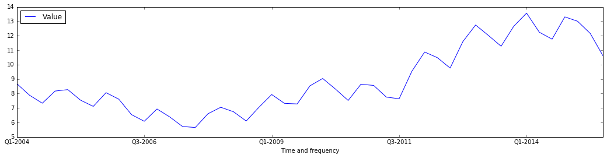
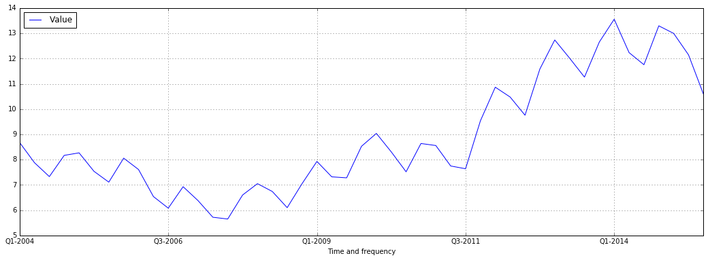

Notebook: using jsonstat.py to explore ISTAT data (unemployment)
~~~~~~~~~~~~~~~~~~~~~~~~~~~~~~~~~~~~~~~~~~~~~~~~~~~~~~~~~~~~~~~~

This Jupyter notebook shows how to use
`jsonstat.py <http://github.com/26fe/jsonstat.py>`__ python library to
explore Istat data. `Istat <http://www.istat.it/en/about-istat>`__ is
the Italian National Institute of Statistics. It publishes a rest api
for browsing italian statistics. This api can return results in
`jsonstat format <https://json-stat.org/>`__.

.. code:: python

    from __future__ import print_function
    import os
    import pandas as pd
    from IPython.core.display import HTML
    import matplotlib.pyplot as plt
    %matplotlib inline
    
    import istat

Using istat api
^^^^^^^^^^^^^^^

Next step is to set a cache dir where to store json files downloaded
from Istat. Storing file on disk speeds up development, and assures
consistent results over time. Eventually, you can delete donwloaded
files to get a fresh copy.

.. code:: python

    cache_dir = os.path.abspath(os.path.join("..", "tmp", "istat_cached")) # you could choice /tmp
    istat.cache_dir(cache_dir)
    print("cache_dir is '{}'".format(istat.cache_dir()))

.. parsed-literal::

    cache_dir is '/Users/26fe_nas/gioprj.on_mac/prj.python/jsonstat.py/tmp/istat_cached'

List all istat areas

.. code:: python

    istat.areas()

.. raw:: html

    <table><tr><th>id</th><th>desc</th></tr><tr><td>3</td><td>2011 Population and housing census</td></td></tr><tr><td>4</td><td>Enterprises</td></td></tr><tr><td>7</td><td>Environment and Energy</td></td></tr><tr><td>8</td><td>Population and Households</td></td></tr><tr><td>9</td><td>Households Economic Conditions and Disparities</td></td></tr><tr><td>10</td><td>Health statistics</td></td></tr><tr><td>11</td><td>Social Security and Welfare</td></td></tr><tr><td>12</td><td>Education and training</td></td></tr><tr><td>13</td><td>Communication, culture and leisure</td></td></tr><tr><td>14</td><td>Justice and Security</td></td></tr><tr><td>15</td><td>Citizens' opinions and satisfaction with life</td></td></tr><tr><td>16</td><td>Social participation</td></td></tr><tr><td>17</td><td>National Accounts</td></td></tr><tr><td>19</td><td>Agriculture</td></td></tr><tr><td>20</td><td>Industry and Construction</td></td></tr><tr><td>21</td><td>Services</td></td></tr><tr><td>22</td><td>Public Administrations and Private Institutions</td></td></tr><tr><td>24</td><td>External Trade and Internationalisation</td></td></tr><tr><td>25</td><td>Prices</td></td></tr><tr><td>26</td><td>Labour</td></td></tr></table>

List all datasets contained into area ``LAB`` (Labour)

.. code:: python

    istat_area_lab = istat.area('LAB')
    istat_area_lab

.. raw:: html

    IstatArea: cod = LAB description = Labour

List all dimension for dataset ``DCCV_TAXDISOCCU`` (Unemployment rate)

.. code:: python

    istat_dataset_taxdisoccu = istat_area_lab.dataset('DCCV_TAXDISOCCU')
    istat_dataset_taxdisoccu

.. raw:: html

    DCCV_TAXDISOCCU(9):Unemployment rate <table><tr><th>nr</th><th>name</th><th>nr. values</th><th>values (first 3 values)</th></tr><tr><td>0</td><td>Territory</td><td>136</td><td>1:'Italy', 3:'Nord', 4:'Nord-ovest' ...</td></td></tr><tr><td>1</td><td>Data type</td><td>1</td><td>6:'unemployment rate'</td></td></tr><tr><td>2</td><td>Measure</td><td>1</td><td>1:'percentage values'</td></td></tr><tr><td>3</td><td>Gender</td><td>3</td><td>1:'males', 2:'females', 3:'total' ...</td></td></tr><tr><td>4</td><td>Age class</td><td>14</td><td>32:'18-29 years', 3:'20-24 years', 4:'15-24 years' ...</td></td></tr><tr><td>5</td><td>Highest level of education attained</td><td>5</td><td>11:'tertiary (university, doctoral and specialization courses)', 12:'total', 3:'primary school certificate, no educational degree' ...</td></td></tr><tr><td>6</td><td>Citizenship</td><td>3</td><td>1:'italian', 2:'foreign', 3:'total' ...</td></td></tr><tr><td>7</td><td>Duration of unemployment</td><td>2</td><td>2:'12 months and more', 3:'total'</td></td></tr><tr><td>8</td><td>Time and frequency</td><td>193</td><td>1536:'Q4-1980', 2049:'Q4-2007', 1540:'1981' ...</td></td></tr></table>

Extract data from dataset ``DCCV_TAXDISOCCU``

.. code:: python

    spec = { 
        "Territory": 0,                            # 1 Italy
        "Data type": 6,                            # (6:'unemployment rate')
        'Measure': 1,                              # 1 : 'percentage values'
        'Gender': 3,                               # 3 total
        'Age class':31,                            # 31:'15-74 years'
        'Highest level of education attained': 12, # 12:'total', 
        'Citizenship': 3,                          # 3:'total')
        'Duration of unemployment': 3,             # 3:'total'
        'Time and frequency': 0                    # All
    }
    
    # convert istat dataset into jsonstat collection and print some info
    collection = istat_dataset_taxdisoccu.getvalues(spec)
    collection

.. raw:: html

    JsonstatCollection contains the following JsonStatDataSet: <table><tr><td>pos</td><td>dataset</td></tr><tr><td>0</td><td>'IDITTER107*IDTIME'</td></tr></table>

Print some info of the only dataset contained into the above jsonstat
collection

.. code:: python

    jsonstat_dataset = collection.dataset(0)
    jsonstat_dataset

.. raw:: html

    name:   'IDITTER107*IDTIME' label:  'Unemployment rate by Territory and Time and frequency - unemployment rate - percentage values - 15-74 years' size: 7830 <table><tr><td>pos</td><td>id</td><td>label</td><td>size</td><td>role</td></tr><tr><td>0</td><td>IDITTER107</td><td>Territory</td><td>135</td><td></td></tr><tr><td>1</td><td>IDTIME</td><td>Time and frequency</td><td>58</td><td></td></tr></table>

.. code:: python

    df_all = jsonstat_dataset.to_table(rtype=pd.DataFrame)
    df_all.head()

.. raw:: html

    

    <table border="1" class="dataframe">
      <thead>
        <tr style="text-align: right;">
          <th></th>
          <th>Territory</th>
          <th>Time and frequency</th>
          <th>Value</th>
        </tr>
      </thead>
      <tbody>
        <tr>
          <th>0</th>
          <td>Italy</td>
          <td>2004</td>
          <td>8.01</td>
        </tr>
        <tr>
          <th>1</th>
          <td>Italy</td>
          <td>Q1-2004</td>
          <td>8.68</td>
        </tr>
        <tr>
          <th>2</th>
          <td>Italy</td>
          <td>Q2-2004</td>
          <td>7.88</td>
        </tr>
        <tr>
          <th>3</th>
          <td>Italy</td>
          <td>Q3-2004</td>
          <td>7.33</td>
        </tr>
        <tr>
          <th>4</th>
          <td>Italy</td>
          <td>Q4-2004</td>
          <td>8.17</td>
        </tr>
      </tbody>
    </table>
    

.. code:: python

    df_all.pivot('Territory', 'Time and frequency', 'Value').head()

.. raw:: html

    

    <table border="1" class="dataframe">
      <thead>
        <tr style="text-align: right;">
          <th>Time and frequency</th>
          <th>2004</th>
          <th>2005</th>
          <th>2006</th>
          <th>2007</th>
          <th>2008</th>
          <th>2009</th>
          <th>2010</th>
          <th>2011</th>
          <th>2012</th>
          <th>2013</th>
          <th>...</th>
          <th>Q4-2005</th>
          <th>Q4-2006</th>
          <th>Q4-2007</th>
          <th>Q4-2008</th>
          <th>Q4-2009</th>
          <th>Q4-2010</th>
          <th>Q4-2011</th>
          <th>Q4-2012</th>
          <th>Q4-2013</th>
          <th>Q4-2014</th>
        </tr>
        <tr>
          <th>Territory</th>
          <th></th>
          <th></th>
          <th></th>
          <th></th>
          <th></th>
          <th></th>
          <th></th>
          <th></th>
          <th></th>
          <th></th>
          <th></th>
          <th></th>
          <th></th>
          <th></th>
          <th></th>
          <th></th>
          <th></th>
          <th></th>
          <th></th>
          <th></th>
          <th></th>
        </tr>
      </thead>
      <tbody>
        <tr>
          <th>Abruzzo</th>
          <td>7.71</td>
          <td>7.88</td>
          <td>6.57</td>
          <td>6.17</td>
          <td>6.63</td>
          <td>7.97</td>
          <td>8.67</td>
          <td>8.59</td>
          <td>10.85</td>
          <td>11.29</td>
          <td>...</td>
          <td>6.95</td>
          <td>6.84</td>
          <td>5.87</td>
          <td>6.67</td>
          <td>7.02</td>
          <td>9.15</td>
          <td>9.48</td>
          <td>10.48</td>
          <td>11.21</td>
          <td>12.08</td>
        </tr>
        <tr>
          <th>Agrigento</th>
          <td>20.18</td>
          <td>17.62</td>
          <td>13.40</td>
          <td>16.91</td>
          <td>16.72</td>
          <td>17.43</td>
          <td>19.42</td>
          <td>17.61</td>
          <td>19.48</td>
          <td>20.98</td>
          <td>...</td>
          <td>NaN</td>
          <td>NaN</td>
          <td>NaN</td>
          <td>NaN</td>
          <td>NaN</td>
          <td>NaN</td>
          <td>NaN</td>
          <td>NaN</td>
          <td>NaN</td>
          <td>NaN</td>
        </tr>
        <tr>
          <th>Alessandria</th>
          <td>5.34</td>
          <td>5.37</td>
          <td>4.65</td>
          <td>4.63</td>
          <td>4.85</td>
          <td>5.81</td>
          <td>5.34</td>
          <td>6.66</td>
          <td>10.48</td>
          <td>11.80</td>
          <td>...</td>
          <td>NaN</td>
          <td>NaN</td>
          <td>NaN</td>
          <td>NaN</td>
          <td>NaN</td>
          <td>NaN</td>
          <td>NaN</td>
          <td>NaN</td>
          <td>NaN</td>
          <td>NaN</td>
        </tr>
        <tr>
          <th>Ancona</th>
          <td>5.11</td>
          <td>4.14</td>
          <td>4.05</td>
          <td>3.49</td>
          <td>3.78</td>
          <td>5.82</td>
          <td>4.94</td>
          <td>6.84</td>
          <td>9.20</td>
          <td>11.27</td>
          <td>...</td>
          <td>NaN</td>
          <td>NaN</td>
          <td>NaN</td>
          <td>NaN</td>
          <td>NaN</td>
          <td>NaN</td>
          <td>NaN</td>
          <td>NaN</td>
          <td>NaN</td>
          <td>NaN</td>
        </tr>
        <tr>
          <th>Arezzo</th>
          <td>4.55</td>
          <td>5.50</td>
          <td>4.88</td>
          <td>4.61</td>
          <td>4.91</td>
          <td>5.51</td>
          <td>5.87</td>
          <td>6.04</td>
          <td>7.33</td>
          <td>8.04</td>
          <td>...</td>
          <td>NaN</td>
          <td>NaN</td>
          <td>NaN</td>
          <td>NaN</td>
          <td>NaN</td>
          <td>NaN</td>
          <td>NaN</td>
          <td>NaN</td>
          <td>NaN</td>
          <td>NaN</td>
        </tr>
      </tbody>
    </table>
    
5 rows × 58 columns

    

.. code:: python

    spec = { 
        "Territory": 1,                            # 1 Italy
        "Data type": 6,                            # (6:'unemployment rate')
        'Measure': 1,
        'Gender': 3,
        'Age class':0,                             # all classes
        'Highest level of education attained': 12, # 12:'total', 
        'Citizenship': 3,                          # 3:'total')
        'Duration of unemployment': 3,             #  3:'total')
        'Time and frequency': 0                    # All
    }
    
    # convert istat dataset into jsonstat collection and print some info
    collection_2 = istat_dataset_taxdisoccu.getvalues(spec)
    collection_2

.. raw:: html

    JsonstatCollection contains the following JsonStatDataSet: <table><tr><td>pos</td><td>dataset</td></tr><tr><td>0</td><td>'IDCLASETA28*IDTIME'</td></tr></table>

.. code:: python

    df = collection_2.dataset(0).to_table(rtype=pd.DataFrame, blocked_dims={'IDCLASETA28':'31'})
    df.head(6)

.. raw:: html

    

    <table border="1" class="dataframe">
      <thead>
        <tr style="text-align: right;">
          <th></th>
          <th>Age class</th>
          <th>Time and frequency</th>
          <th>Value</th>
        </tr>
      </thead>
      <tbody>
        <tr>
          <th>0</th>
          <td>15-74 years</td>
          <td>Q4-1992</td>
          <td>NaN</td>
        </tr>
        <tr>
          <th>1</th>
          <td>15-74 years</td>
          <td>1993</td>
          <td>NaN</td>
        </tr>
        <tr>
          <th>2</th>
          <td>15-74 years</td>
          <td>Q1-1993</td>
          <td>NaN</td>
        </tr>
        <tr>
          <th>3</th>
          <td>15-74 years</td>
          <td>Q2-1993</td>
          <td>NaN</td>
        </tr>
        <tr>
          <th>4</th>
          <td>15-74 years</td>
          <td>Q3-1993</td>
          <td>NaN</td>
        </tr>
        <tr>
          <th>5</th>
          <td>15-74 years</td>
          <td>Q4-1993</td>
          <td>NaN</td>
        </tr>
      </tbody>
    </table>
    

.. code:: python

    df = df.dropna()
    df = df[df['Time and frequency'].str.contains(r'^Q.*')]
    # df = df.set_index('Time and frequency')
    df.head(6)

.. raw:: html

    

    <table border="1" class="dataframe">
      <thead>
        <tr style="text-align: right;">
          <th></th>
          <th>Age class</th>
          <th>Time and frequency</th>
          <th>Value</th>
        </tr>
      </thead>
      <tbody>
        <tr>
          <th>57</th>
          <td>15-74 years</td>
          <td>Q1-2004</td>
          <td>8.68</td>
        </tr>
        <tr>
          <th>58</th>
          <td>15-74 years</td>
          <td>Q2-2004</td>
          <td>7.88</td>
        </tr>
        <tr>
          <th>59</th>
          <td>15-74 years</td>
          <td>Q3-2004</td>
          <td>7.33</td>
        </tr>
        <tr>
          <th>60</th>
          <td>15-74 years</td>
          <td>Q4-2004</td>
          <td>8.17</td>
        </tr>
        <tr>
          <th>62</th>
          <td>15-74 years</td>
          <td>Q1-2005</td>
          <td>8.27</td>
        </tr>
        <tr>
          <th>63</th>
          <td>15-74 years</td>
          <td>Q2-2005</td>
          <td>7.54</td>
        </tr>
      </tbody>
    </table>
    

.. code:: python

    df.plot(x='Time and frequency',y='Value', figsize=(18,4))

.. parsed-literal::

    <matplotlib.axes._subplots.AxesSubplot at 0x1184b1908>

.. code:: python

    fig = plt.figure(figsize=(18,6))
    ax = fig.add_subplot(111)
    plt.grid(True)
    df.plot(x='Time and frequency',y='Value', ax=ax, grid=True) 
    # kind='barh', , alpha=a, legend=False, color=customcmap,
    # edgecolor='w', xlim=(0,max(df['population'])), title=ttl)

.. parsed-literal::

    <matplotlib.axes._subplots.AxesSubplot at 0x11a898b70>

.. code:: python

    # plt.figure(figsize=(7,4))
    # plt.plot(df['Time and frequency'],df['Value'], lw=1.5, label='1st')
    # plt.plot(y[:,1], lw=1.5, label='2st')
    # plt.plot(y,'ro')
    # plt.grid(True)
    # plt.legend(loc=0)
    # plt.axis('tight')
    # plt.xlabel('index')
    # plt.ylabel('value')
    # plt.title('a simple plot')

.. code:: python

    # forza lavoro
    istat_forzlv = istat.dataset('LAB', 'DCCV_FORZLV')
    
    spec = { 
        "Territory": 'Italy',                            
        "Data type": 'number of labour force 15 years and more (thousands)',                            # 
        'Measure':   'absolute values',               
        'Gender':    'total',                               
        'Age class': '15 years and over',                            
        'Highest level of education attained': 'total', 
        'Citizenship': 'total',                         
        'Time and frequency': 0                    
    }
    
    df_forzlv = istat_forzlv.getvalues(spec).dataset(0).to_table(rtype=pd.DataFrame)
    df_forzlv = df_forzlv.dropna()
    df_forzlv = df_forzlv[df_forzlv['Time and frequency'].str.contains(r'^Q.*')]
    df_forzlv.tail(6)

.. raw:: html

    

    <table border="1" class="dataframe">
      <thead>
        <tr style="text-align: right;">
          <th></th>
          <th>Time and frequency</th>
          <th>Value</th>
        </tr>
      </thead>
      <tbody>
        <tr>
          <th>187</th>
          <td>Q2-2014</td>
          <td>25419.15</td>
        </tr>
        <tr>
          <th>188</th>
          <td>Q3-2014</td>
          <td>25373.70</td>
        </tr>
        <tr>
          <th>189</th>
          <td>Q4-2014</td>
          <td>25794.44</td>
        </tr>
        <tr>
          <th>190</th>
          <td>Q1-2015</td>
          <td>25460.25</td>
        </tr>
        <tr>
          <th>191</th>
          <td>Q2-2015</td>
          <td>25598.29</td>
        </tr>
        <tr>
          <th>192</th>
          <td>Q3-2015</td>
          <td>25321.61</td>
        </tr>
      </tbody>
    </table>
    

.. code:: python

    istat_inattiv = istat.dataset('LAB', 'DCCV_INATTIV')
    # HTML(istat_inattiv.info_dimensions_as_html())

.. code:: python

    spec = { 
        "Territory": 'Italy',                            
        "Data type": 'number of inactive persons',                           
        'Measure':   'absolute values',               
        'Gender':    'total',                               
        'Age class': '15 years and over',                            
        'Highest level of education attained': 'total', 
        'Time and frequency': 0                    
    }
    
    df_inattiv = istat_inattiv.getvalues(spec).dataset(0).to_table(rtype=pd.DataFrame)
    df_inattiv = df_inattiv.dropna()
    df_inattiv = df_inattiv[df_inattiv['Time and frequency'].str.contains(r'^Q.*')]
    df_inattiv.tail(6)

.. raw:: html

    

    <table border="1" class="dataframe">
      <thead>
        <tr style="text-align: right;">
          <th></th>
          <th>citizenship</th>
          <th>Labour status</th>
          <th>Inactivity reasons</th>
          <th>Main status</th>
          <th>Time and frequency</th>
          <th>Value</th>
        </tr>
      </thead>
      <tbody>
        <tr>
          <th>24756</th>
          <td>total</td>
          <td>total</td>
          <td>total</td>
          <td>total</td>
          <td>Q2-2014</td>
          <td>26594.57</td>
        </tr>
        <tr>
          <th>24757</th>
          <td>total</td>
          <td>total</td>
          <td>total</td>
          <td>total</td>
          <td>Q3-2014</td>
          <td>26646.90</td>
        </tr>
        <tr>
          <th>24758</th>
          <td>total</td>
          <td>total</td>
          <td>total</td>
          <td>total</td>
          <td>Q4-2014</td>
          <td>26257.15</td>
        </tr>
        <tr>
          <th>24759</th>
          <td>total</td>
          <td>total</td>
          <td>total</td>
          <td>total</td>
          <td>Q1-2015</td>
          <td>26608.07</td>
        </tr>
        <tr>
          <th>24760</th>
          <td>total</td>
          <td>total</td>
          <td>total</td>
          <td>total</td>
          <td>Q2-2015</td>
          <td>26487.67</td>
        </tr>
        <tr>
          <th>24761</th>
          <td>total</td>
          <td>total</td>
          <td>total</td>
          <td>total</td>
          <td>Q3-2015</td>
          <td>26746.26</td>
        </tr>
      </tbody>
    </table>
    

