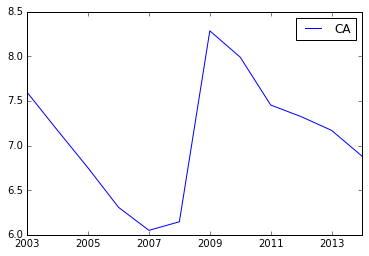

Notebook: using jsonstat.py python library
------------------------------------------

This Jupyter notebook shows the python library
`jsonstat.py <http://github.com/26fe/jsonstat.py>`__ in action. The
`JSON-stat <https://json-stat.org/>`__ is a simple lightweight JSON
dissemination format. This example shows how to explore the jsonstat
data file
`oecd-canada <http://json-stat.org/samples/oecd-canada.json>`__ from
json-stat.org site.

.. code:: python

    from __future__ import print_function
    import os
    import pandas as ps # using panda to convert jsonstat dataset to pandas dataframe
    import jsonstat # import jsonstat.py package

Download or use cached file oecd-canada.json.

.. code:: python

    url = 'http://json-stat.org/samples/oecd-canada.json'
    file_name = "oecd-canada.json"
    
    file_path = os.path.abspath(os.path.join("..", "tests", "fixtures", "collection", file_name))
    if os.path.exists(file_path):
        print("using file from fixtures")
    else:
        print("download file into the current directory")
        jsonstat.download(url, file_name)
        file_path = file_name

.. parsed-literal::

    using file from fixtures

Initialize JsonStatCollection from the file and print some info.

.. code:: python

    collection = jsonstat.JsonStatCollection()
    collection.from_file(file_path)
    collection.info()

.. parsed-literal::

    0: dataset 'oecd'
    1: dataset 'canada'
    

.. code:: python

    oecd = collection.dataset('oecd')
    print("*** dataset '{} info".format(oecd.name()))
    oecd.info()

.. parsed-literal::

    *** dataset 'oecd info
    name:   'oecd'
    label:  'Unemployment rate in the OECD countries 2003-2014'
    source: 'Unemployment rate in the OECD countries 2003-2014'
    size: 432
    3 dimensions:
      0: dim id/name: 'concept' size: '1' role: 'metric'
      1: dim id/name: 'area' size: '36' role: 'geo'
      2: dim id/name: 'year' size: '12' role: 'time'
    

.. code:: python

    for d in oecd.dimensions():
        print("*** info for dimensions '{}'".format(d.name()))
        d.info()

.. parsed-literal::

    *** info for dimensions 'concept'
    index
      pos    idx  label
        0    UNR unemployment rate
    
    *** info for dimensions 'area'
    index
      pos    idx  label
        0     AU Australia
        1     AT Austria
        2     BE Belgium
        3     CA Canada
        4     CL  Chile
        5     CZ Czech Republic
        6     DK Denmark
        7     EE Estonia
        8     FI Finland
        9     FR France
       10     DE Germany
       11     GR Greece
       12     HU Hungary
       13     IS Iceland
       14     IE Ireland
       15     IL Israel
       16     IT  Italy
       17     JP  Japan
       18     KR  Korea
       19     LU Luxembourg
       20     MX Mexico
       21     NL Netherlands
       22     NZ New Zealand
       23     NO Norway
       24     PL Poland
       25     PT Portugal
       26     SK Slovak Republic
       27     SI Slovenia
       28     ES  Spain
       29     SE Sweden
       30     CH Switzerland
       31     TR Turkey
       32     UK United Kingdom
       33     US United States
       34   EU15 Euro area (15 countries)
       35   OECD  total
    
    *** info for dimensions 'year'
    index
      pos    idx  label
        0   2003       
        1   2004       
        2   2005       
        3   2006       
        4   2007       
        5   2008       
        6   2009       
        7   2010       
        8   2011       
        9   2012       
       10   2013       
       11   2014       
    

Print the value in oecd dataset for area = IT and year = 2012

.. code:: python

    oecd.value(area='IT', year='2012')

.. parsed-literal::

    10.55546863

Extract a subset of data in a pandas dataframe from the jsonstat
dataset:

.. code:: python

    df = oecd.to_data_frame('year', area='CA')
    print(df)

.. parsed-literal::

                CA
    2003  7.594617
    2004  7.167834
    2005  6.748692
    2006  6.307841
    2007  6.049843
    2008  6.146015
    2009  8.284689
    2010  7.988900
    2011  7.453610
    2012  7.323584
    2013  7.169742
    2014  6.881227

.. code:: python

    import matplotlib as plt
    %matplotlib inline
    df.plot()

.. parsed-literal::

    <matplotlib.axes._subplots.AxesSubplot at 0x1081b8c90>

.. code:: python

    oecd.to_table()[:5]

.. parsed-literal::

    [[u'indicator', u'OECD countries, EU15 and total', u'2003-2014', u'Value'],
     [u'unemployment rate', u'Australia', u'2003', 5.943826289],
     [u'unemployment rate', u'Austria', u'2003', 4.278559338],
     [u'unemployment rate', u'Belgium', u'2003', 8.158333333],
     [u'unemployment rate', u'Canada', u'2003', 7.594616751]]

.. code:: python

    order = [i.name() for i in oecd.dimensions()]
    order = order[::-1]  # reverse list
    order = oecd.from_vec_idx_to_vec_dim(order)
    table = oecd.to_table(order=order)
    table[:5]

.. parsed-literal::

    [[u'indicator', u'OECD countries, EU15 and total', u'2003-2014', u'Value'],
     [u'unemployment rate', u'Australia', u'2003', 5.943826289],
     [u'unemployment rate', u'Australia', u'2004', 5.39663128],
     [u'unemployment rate', u'Australia', u'2005', 5.044790587],
     [u'unemployment rate', u'Australia', u'2006', 4.789362794]]

.. code:: python

    # oecd.value(concept='unemployment rate',area='Australia',year='2004') # 5.39663128
    # TODO: use also label other than index
    # TODO: better error message than 'Key Error'
    oecd.value(concept='UNR',area='AU',year='2004')

.. parsed-literal::

    5.39663128

