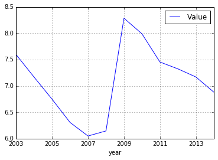

Notebook: using jsonstat.py python library with jsonstat format version 2.
~~~~~~~~~~~~~~~~~~~~~~~~~~~~~~~~~~~~~~~~~~~~~~~~~~~~~~~~~~~~~~~~~~~~~~~~~~

This Jupyter notebook shows the python library
`jsonstat.py <http://github.com/26fe/jsonstat.py>`__ in action. The
`JSON-stat <https://json-stat.org/>`__ is a simple lightweight JSON
dissemination format. For more information about the format see the
`official site <https://json-stat.org/>`__.

In this notebook it is used the data file
`oecd-canada-col.json <http://json-stat.org/samples/oecd-canada-col.json>`__
from json-stat.org site. This file is compliant to the version 2 of
jsonstat. This notebook is equal to version 1. The only difference is
the datasource.

.. code:: python

    # all import here
    from __future__ import print_function
    import os
    import pandas as ps # using panda to convert jsonstat dataset to pandas dataframe
    import jsonstat     # import jsonstat.py package
    
    import matplotlib as plt  # for plotting 
    %matplotlib inline

Download or use cached file oecd-canada-col.json. Caching file on disk
permits to work off-line and to speed up the exploration of the data.

.. code:: python

    url = 'http://json-stat.org/samples/oecd-canada-col.json'
    file_name = "oecd-canada-col.json"
    
    file_path = os.path.abspath(os.path.join("..", "tests", "fixtures", "www.json-stat.org", file_name))
    if os.path.exists(file_path):
        print("using already downloaded file {}".format(file_path))
    else:
        print("download file and storing on disk")
        jsonstat.download(url, file_name)
        file_path = file_name

.. parsed-literal::

    using already downloaded file /Users/26fe_nas/gioprj.on_mac/prj.python/jsonstat.py/tests/fixtures/www.json-stat.org/oecd-canada-col.json

Initialize JsonStatCollection from the file and print the list of
dataset contained into the collection.

.. code:: python

    collection = jsonstat.from_file(file_path)
    collection

.. raw:: html

    JsonstatCollection contains the following JsonStatDataSet: <table><tr><td>pos</td><td>dataset</td></tr><tr><td>0</td><td>'Unemployment rate in the OECD countries 2003-2014'</td></tr><tr><td>1</td><td>'Population by sex and age group. Canada. 2012'</td></tr></table>

Select the firt dataset. Oecd dataset has three dimensions (concept,
area, year), and contains 432 values.

.. code:: python

    oecd = collection.dataset(0)
    oecd

.. raw:: html

    name:   'Unemployment rate in the OECD countries 2003-2014' label:  'Unemployment rate in the OECD countries 2003-2014' size: 3 <table><tr><td>pos</td><td>id</td><td>label</td><td>size</td><td>role</td></tr><tr><td>0</td><td>concept</td><td>indicator</td><td>1</td><td>metric</td></tr><tr><td>1</td><td>area</td><td>OECD countries, EU15 and total</td><td>36</td><td>geo</td></tr><tr><td>2</td><td>year</td><td>2003-2014</td><td>12</td><td>time</td></tr></table>

.. code:: python

    oecd.dimension('concept')

.. raw:: html

    <table><tr><td>pos</td><td>idx</td><td>label</td></tr><tr><td>0</td><td>'UNR'</td><td>'unemployment rate'</td></tr></table>

.. code:: python

    oecd.dimension('area')

.. raw:: html

    <table><tr><td>pos</td><td>idx</td><td>label</td></tr><tr><td>0</td><td>'AU'</td><td>'Australia'</td></tr><tr><td>1</td><td>'AT'</td><td>'Austria'</td></tr><tr><td>2</td><td>'BE'</td><td>'Belgium'</td></tr><tr><td>3</td><td>'CA'</td><td>'Canada'</td></tr><td>...</td><td>...</td><td>...</td></table>

.. code:: python

    oecd.dimension('year')

.. raw:: html

    <table><tr><td>pos</td><td>idx</td><td>label</td></tr><tr><td>0</td><td>'2003'</td><td>''</td></tr><tr><td>1</td><td>'2004'</td><td>''</td></tr><tr><td>2</td><td>'2005'</td><td>''</td></tr><tr><td>3</td><td>'2006'</td><td>''</td></tr><td>...</td><td>...</td><td>...</td></table>

Shows some detailed info about dimensions.

Accessing value in the dataset
^^^^^^^^^^^^^^^^^^^^^^^^^^^^^^

Print the value in oecd dataset for area = IT and year = 2012

.. code:: python

    oecd.data(area='IT', year='2012')

.. parsed-literal::

    JsonStatValue(idx=201, value=10.55546863, status=None)

.. code:: python

    oecd.value(area='IT', year='2012')

.. parsed-literal::

    10.55546863

.. code:: python

    oecd.value(concept='unemployment rate',area='Australia',year='2004') # 5.39663128

.. parsed-literal::

    5.39663128

.. code:: python

    oecd.value(concept='UNR',area='AU',year='2004')

.. parsed-literal::

    5.39663128

Trasforming dataset into pandas DataFrame
^^^^^^^^^^^^^^^^^^^^^^^^^^^^^^^^^^^^^^^^^

.. code:: python

    df_oecd = oecd.to_data_frame('year', content='id')
    df_oecd.head()

.. raw:: html

    

    <table border="1" class="dataframe">
      <thead>
        <tr style="text-align: right;">
          <th></th>
          <th>concept</th>
          <th>area</th>
          <th>Value</th>
        </tr>
        <tr>
          <th>year</th>
          <th></th>
          <th></th>
          <th></th>
        </tr>
      </thead>
      <tbody>
        <tr>
          <th>2003</th>
          <td>UNR</td>
          <td>AU</td>
          <td>5.943826</td>
        </tr>
        <tr>
          <th>2004</th>
          <td>UNR</td>
          <td>AU</td>
          <td>5.396631</td>
        </tr>
        <tr>
          <th>2005</th>
          <td>UNR</td>
          <td>AU</td>
          <td>5.044791</td>
        </tr>
        <tr>
          <th>2006</th>
          <td>UNR</td>
          <td>AU</td>
          <td>4.789363</td>
        </tr>
        <tr>
          <th>2007</th>
          <td>UNR</td>
          <td>AU</td>
          <td>4.379649</td>
        </tr>
      </tbody>
    </table>
    

.. code:: python

    df_oecd['area'].describe() # area contains 36 values

.. parsed-literal::

    count     432
    unique     36
    top        ES
    freq       12
    Name: area, dtype: object

Extract a subset of data in a pandas dataframe from the jsonstat
dataset. We can trasform dataset freezing the dimension area to a
specific country (Canada)

.. code:: python

    df_oecd_ca = oecd.to_data_frame('year', content='id', blocked_dims={'area':'CA'})
    df_oecd_ca.tail()

.. raw:: html

    

    <table border="1" class="dataframe">
      <thead>
        <tr style="text-align: right;">
          <th></th>
          <th>concept</th>
          <th>area</th>
          <th>Value</th>
        </tr>
        <tr>
          <th>year</th>
          <th></th>
          <th></th>
          <th></th>
        </tr>
      </thead>
      <tbody>
        <tr>
          <th>2010</th>
          <td>UNR</td>
          <td>CA</td>
          <td>7.988900</td>
        </tr>
        <tr>
          <th>2011</th>
          <td>UNR</td>
          <td>CA</td>
          <td>7.453610</td>
        </tr>
        <tr>
          <th>2012</th>
          <td>UNR</td>
          <td>CA</td>
          <td>7.323584</td>
        </tr>
        <tr>
          <th>2013</th>
          <td>UNR</td>
          <td>CA</td>
          <td>7.169742</td>
        </tr>
        <tr>
          <th>2014</th>
          <td>UNR</td>
          <td>CA</td>
          <td>6.881227</td>
        </tr>
      </tbody>
    </table>
    

.. code:: python

    df_oecd_ca['area'].describe()  # area contains only one value (CA)

.. parsed-literal::

    count     12
    unique     1
    top       CA
    freq      12
    Name: area, dtype: object

.. code:: python

    df_oecd_ca.plot(grid=True)

.. parsed-literal::

    <matplotlib.axes._subplots.AxesSubplot at 0x114298198>

Trasforming a dataset into a python list
^^^^^^^^^^^^^^^^^^^^^^^^^^^^^^^^^^^^^^^^

.. code:: python

    oecd.to_table()[:5]

.. parsed-literal::

    [['indicator', 'OECD countries, EU15 and total', '2003-2014', 'Value'],
     ['unemployment rate', 'Australia', '2003', 5.943826289],
     ['unemployment rate', 'Australia', '2004', 5.39663128],
     ['unemployment rate', 'Australia', '2005', 5.044790587],
     ['unemployment rate', 'Australia', '2006', 4.789362794]]

It is possible to trasform jsonstat data into table in different order

.. code:: python

    order = [i.did() for i in oecd.dimensions()]
    order = order[::-1]  # reverse list
    table = oecd.to_table(order=order)
    table[:5]

.. parsed-literal::

    [['indicator', 'OECD countries, EU15 and total', '2003-2014', 'Value'],
     ['unemployment rate', 'Australia', '2003', 5.943826289],
     ['unemployment rate', 'Austria', '2003', 4.278559338],
     ['unemployment rate', 'Belgium', '2003', 8.158333333],
     ['unemployment rate', 'Canada', '2003', 7.594616751]]

